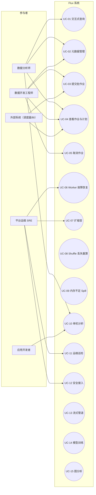

# Flux 软件需求规格说明书（SRS）

| 文档属性 | 内容 |
| --- | --- |
| 项目名称 | Flux 分布式计算引擎 |
| 文档版本 | v0.3（传输约束变更：ADR-011） |
| 文档状态 | 待评审 |
| 更新日期 | 2026-09-01 |
| 相关文档 | [PRD 文档](02-PRD文档.md)、[概要设计说明书](03-概要设计说明书.md)、[详细设计说明书](04-详细设计说明书.md) |

> 阅读指引：本文档定义 Flux "做什么"。第 3 章是用例模型（谁在什么场景下做什么）；第 4 章是逐条功能需求规格（输入/处理/输出/验收）；第 5 章是数据字典；第 6 章是接口需求；第 7 章是非功能需求及其度量方法；第 8 章是里程碑验收测试规格。

## 1. 引言

### 1.1 编写目的

本文档面向产品、架构、开发与测试人员，完整定义 Flux 分布式计算引擎的功能需求与非功能需求，作为设计、开发、测试与验收的**唯一需求基线**。任何实现与本文档冲突之处，以变更流程（第 9 章）裁决后修正其一。

### 1.2 范围

覆盖：数据与元数据管理、SQL 查询接口、批处理执行引擎、查询优化、流处理、机器学习、图计算、集群与资源管理、运维与可观测性、安全共十个功能域；以及性能、可扩展性、可靠性、兼容性、可维护性、可移植性、安全七类非功能需求。

不覆盖（见 PRD"非目标"）：BI 可视化产品、自研存储引擎、通用资源调度器市场、Spark 私有 API 兼容。

### 1.3 读者与使用方式

| 读者 | 重点章节 |
| --- | --- |
| 产品/项目经理 | 第 2、3、8 章 |
| 架构师/开发 | 第 4、5、6 章（配合设计文档） |
| 测试工程师 | 第 3、4、7、8 章（用例与验收标准直接转测试用例） |
| 运维/SRE | 第 2.3、7、8 章 |

### 1.4 术语与缩略语

| 术语 | 说明 |
| --- | --- |
| Flux | 本项目，分布式计算引擎 |
| Master / flux-master | Go 实现的控制面进程：集群管理、作业调度、元数据目录、对外 API |
| Worker / flux-worker | Rust 实现的数据面进程：SQL 编译、物理执行、Shuffle |
| 数据平面 / 控制平面 | 数据平面 = 执行引擎与数据流；控制平面 = 集群与作业管理 |
| Arrow / RecordBatch | Apache Arrow 列式内存格式；`RecordBatch` 为一组等长列数组的批数据单元 |
| Arrow IPC / Arrow Flight | Arrow 的进程间/文件序列化编码；基于 gRPC 的列式数据传输服务 |
| Parquet | 列式存储文件格式（持久数据格式） |
| Shuffle | 分布式执行中跨 Worker 的数据重分区与传输 |
| Stage / Task | 作业按 Shuffle 边界切分的执行阶段 / Stage 内按分区划分的并行执行单元 |
| Slot | Worker 上可分配给 Task 的资源单位（1 slot ≈ 1 CPU 核 + 配额内存） |
| Spill | 内存不足时将中间数据落盘的行为 |
| Catalog / 目录 | 库/表/分区元数据集合 |
| StateStore | Master 状态持久化存储（默认 SQLite，可选 Postgres） |
| PlanService / TaskService | Worker 上的 SQL 编译服务 / 任务执行服务（详见设计文档） |
| TPC-H / TPC-DS | 行业标准决策支持基准测试 |
| 单机模式 | 无 Master、SDK/CLI 直接驱动 Rust 引擎本地执行的嵌入式形态 |
| RBO / CBO | 基于规则的优化 / 基于代价的优化 |
| Watermark（水位） | 流处理中衡量事件时间进度的机制 |
| exactly-once | 端到端恰好一次语义（故障后不丢不重） |
| M0–M7 | 里程碑编号，见第 8 章 |
| P0/P1/P2 | 需求优先级：P0 = MVP（M1/M2）必须；P1 = 生产可用（M3/M4）必须；P2 = 完整对标（M5+） |

### 1.5 参考资料

- Apache Spark 3.5 官方文档（对标基线）
- Apache Arrow 列式格式规范、Arrow Flight RPC 规范
- Apache Parquet 格式规范
- TPC-H v3.0.0、TPC-DS v3.2 基准规范
- ANSI SQL:2016（SQL 语言特性参照）
- GB/T 8567-2006《计算机软件文档编制规范》（文档结构参考）
- W3C Trace Context（追踪上下文传播标准）

## 2. 总体描述

### 2.1 产品定位与运行形态

**一句话定位**：云原生时代的 Spark 替代品——用 Rust 自研内核获得原生性能与资源效率，用 Go 控制面获得简单的集群运维体验。

| 形态 | 说明 | 对标 | 交付里程碑 |
| --- | --- | --- | --- |
| 单机嵌入式模式 | SDK/CLI 直接驱动 Rust 引擎在本进程执行；无 Master；数据可本地或对象存储 | 介于 DuckDB 与 Spark 单机之间 | M1 |
| 分布式集群模式 | 自研 Master(Go)/Worker(Rust) 独立集群；注册/心跳/槽位调度；容错 | Spark Standalone | M2 |
| K8s Operator | 以 CRD 管理 Flux 集群、自动扩缩容 | Spark on K8s（Operator 形态） | M7+ |

### 2.2 产品能力矩阵（全面对标 Spark）

| Spark 能力 | Flux 对应能力 | 关键需求 | 交付 |
| --- | --- | --- | --- |
| Spark Core（DAG 调度、分布式执行、容错） | Flux Core | FR-C、FR-CL | M1–M2 |
| Spark SQL（SQL/DF、Catalyst、数据源 API） | Flux SQL | FR-A、FR-B、FR-O | M1–M3 |
| Structured Streaming | Flux Streaming | FR-S | M5 |
| MLlib | Flux ML | FR-ML | M6 |
| GraphX | Flux Graph | FR-G | M6 |
| Standalone/YARN/K8s | 自研集群 + 后期 Operator | FR-CL | M2 / M7+ |

### 2.3 运行环境

| 项 | 要求 |
| --- | --- |
| 操作系统 | 生产：Linux x86_64 / arm64（glibc ≥ 2.28 或 musl 静态）；开发：macOS（Intel/Apple Silicon）、Windows（WSL2/Git Bash） |
| CPU | 最低 2 核；推荐 8 核+（Worker 节点） |
| 内存 | 单机模式最低 512MB；Worker 推荐 ≥ 8GB |
| 磁盘 | Worker 需本地盘用于 Shuffle/Spill（推荐 NVMe/SSD，容量见 NFR-SCALE） |
| 运行时依赖 | **无**：核心进程为静态编译二进制，无 JVM、无解释器、无共享库强依赖 |
| 对象存储 | S3 兼容（AWS S3 / 阿里云 OSS / MinIO / 腾讯云 COS 等），凭证使用 AK/SK 或 IAM Role（P1） |
| 网络 | 节点间万兆/千兆内网；Master↔Worker、Worker↔Worker 双向可达 |

**默认端口规划**（全部可配置，见详细设计第 10 章；**网络端口仅服务跨机通信——同机 Go↔Rust 链路走共享内存 IPC，不占用端口（ADR-011）**）：

| 进程 | 端口 | 协议 | 用途 |
| --- | --- | --- | --- |
| Master | 9090 | gRPC | 客户端/Worker 接入 |
| Master | 8080 | HTTP | REST API / Web UI |
| Master | 9095 | HTTP | Prometheus 指标 |
| Worker | 9091 | gRPC | Master → Worker 控制 |
| Worker | 9092 | Arrow Flight | Worker ↔ Worker Shuffle 数据 |
| Worker | 9096 | HTTP | Prometheus 指标 |

### 2.4 设计与实现约束

1. **语言分工**：Rust 承担大数据核心处理（SQL 解析、查询优化、物理执行、内存管理、Shuffle）；Go 承担云原生控制面（集群管理、作业调度、REST/gRPC 服务、可观测性、运维工具）。
2. **进程边界**：Go 与 Rust 之间的消息契约为 Protobuf（控制流）与 Arrow IPC（数据流）；**传输规则（ADR-011）：同机通信一律共享内存 IPC，禁止 TCP 回环**，网络（gRPC/Arrow Flight）仅用于跨机场景。**禁止任何形式 FFI 相互调用**。
3. **内核自研**：SQL 解析器、查询优化器、物理执行引擎完全自研；允许复用的仅为数据格式标准实现与基础库（arrow-rs、object_store、tokio/tonic 等，白名单见架构维护文档）。
4. **开放标准优先**：落盘格式必须是开放标准（Parquet/Arrow IPC），不得引入私有闭源格式。
5. **无 JVM 约束**：任何组件不得依赖 JVM 运行时。

### 2.5 用户特征

| 用户 | 规模估计 | 特征 | 主要诉求 | 对应用例 |
| --- | --- | --- | --- | --- |
| 数据平台工程师 | 核心用户 | 熟悉 Spark/Flink，负责平台部署运维 | 部署简单、资源省、可观测性好、故障可定位 | UC-06/07/11/12 |
| 数据分析师 | 核心用户 | SQL 熟练，不关心底层 | 标准兼容的 SQL、低延迟交互查询、稳定 | UC-01/04/10 |
| 数据开发工程师 | 核心用户 | 写 ETL/批处理作业，用调度器编排 | 完整 SQL、容错、可编程提交接口 | UC-03/05 |
| 应用开发者 | 次要 | 通过 SDK 嵌入分析能力 | 单机模式易用、API 稳定、资源占用小 | UC-10 |
| 外部系统 | 非人类 | Airflow/DolphinScheduler、BI 工具、Prometheus | 标准 API 与指标 | UC-03/04/11 |

### 2.6 假设与依赖

- 假设生产部署环境具备 S3 兼容对象存储；单机模式假设本地盘可写。
- 依赖 Rust stable 与 Go（最新两个大版本）编译工具链。
- 依赖 Arrow/Parquet 格式标准的长期稳定性（作为兼容面承诺）。
- 假设集群内节点时钟同步（NTP），时钟偏移 > 1s 时 `flux doctor` 告警（不做强制校验，因不参与数据一致性）。

## 3. 用例模型

### 3.1 参与者与用例总览

### 3.2 用例详述

#### UC-01 提交互式 SQL 查询（小结果）

| 项 | 内容 |
| --- | --- |
| 参与者 | 数据分析师 |
| 前置条件 | 集群运行中；用户已通过认证（M3 起）；目标表已存在 |
| 触发 | 用户在 CLI 中输入 SQL 并回车，或经 SDK 提交 |

主流程：

1. 客户端建立与 Master 的 gRPC 长连接，提交 `RunQuery(SQL)`。
2. Master 校验会话与权限（M3 起），获取目录快照。
3. Master 将 SQL + 目录快照发送至某 Worker 的 PlanService 编译为物理计划 DAG。
4. Master 按调度策略依次派发各 Stage 的 Task 至 Worker。
5. Worker 执行 Task；跨 Stage 数据经 Shuffle 传输。
6. 最终结果以流式 Arrow IPC 返回客户端，客户端渲染表格。

备选流：

- A1（第 3 步，SQL 错误）：编译失败返回 1xxx 错误码与带行列位置的错误信息，会话保持。
- A2（第 4 步，无可用资源）：作业排队，CLI 显示排队状态；超过 `queue_timeout`（默认 300s）返回 4006。
- A3（第 5 步，Task 失败）：按 FR-C05 自动重试；重试耗尽则作业失败并返回最终错误链。
- A4（结果超阈值）：转入 UC-03 的结果交付方式（写对象存储返回 URI）。
- A5（用户 Ctrl+C）：触发 UC-05 取消。

| 项 | 内容 |
| --- | --- |
| 后置条件 | 作业终态（SUCCEEDED/FAILED/CANCELLED）落入作业历史；Shuffle 临时数据被清理 |
| 关联需求 | FR-B01–B07、FR-C01–C07、FR-OP02 |
| 优先级 | P0 |

#### UC-02 管理元数据（库/表/分区）

| 项 | 内容 |
| --- | --- |
| 参与者 | 数据分析师、数据开发工程师 |
| 前置条件 | 已连接集群；有相应权限（M4 起） |

主流程：

1. 用户执行 DDL（`CREATE DATABASE/TABLE`、`DROP`、`ALTER`、`SHOW`、`DESCRIBE`）。
2. Master 校验：命名规则、对象存在性（IF [NOT] EXISTS 语义）、Schema 合法性（列类型/分区列约束）。
3. DDL 原子提交至 StateStore；对表类 DDL 同步完成存储层操作（建目录前缀 / 删除数据前缀，删除需确认）。
4. 返回执行结果；`SHOW`/`DESCRIBE` 返回元数据列表。

备选流：A1 对象已存在且无 IF NOT EXISTS → 返回 1009 类错误，状态不变；A2 DROP 库下有表 → 拒绝（除非 CASCADE）；A3 事务失败 → 回滚，目录与存储均无变化。

| 项 | 内容 |
| --- | --- |
| 后置条件 | 目录元数据与存储状态一致；并发 DDL 串行化，无中间态可见 |
| 关联需求 | FR-A01–A03、FR-A09、FR-SEC03（M4） |
| 优先级 | P0 |

#### UC-03 提交批处理作业（ETL / CTAS / INSERT）

| 项 | 内容 |
| --- | --- |
| 参与者 | 数据开发工程师、外部调度系统 |
| 前置条件 | 目标库表存在（或使用 CTAS 创建）；对象存储凭证有效 |

主流程：

1. 客户端提交 `SubmitJob(JobSpec)`：SQL（或多语句文件引用）、资源声明（可选）、作业名（可选）。
2. Master 创建作业记录（`job_<ulid>`），进入 Planning。
3. 编译 → 物理计划 → 按 Stage 调度执行（同 UC-01 步骤 4–5）。
4. 最终 Stage 的结果按计划中的 sink 写入：INSERT → 追加目标表分区；CTAS → 建表并写入；查询类 → 写结果区。
5. 写入以"临时前缀 + 提交清单（manifest）"完成原子提交；目录元数据更新（分区/统计）。
6. 作业转 SUCCEEDED，客户端收到 `ResultManifest`（URI、行数、字节数）。

备选流：A1 写入中途失败 → 作业按 FR-C05 重试，未提交的临时数据由清理机制回收，目标表无部分写入；A2 目标分区已存在且 INSERT OVERWRITE → 提交时原子替换；A3 作业失败/取消 → 同 A1 清理，返回错误。

| 项 | 内容 |
| --- | --- |
| 后置条件 | 目标表数据要么完整提交、要么完全未提交（作业级原子性） |
| 关联需求 | FR-A09、FR-C01–C07、FR-OP05 |
| 优先级 | P0 |

#### UC-04 查看作业状态与执行计划

主流程：用户/外部系统调用 `GetJob/ListJobs` 或 Web UI → 返回作业状态、Stage/Task 进度与指标（输入行数、输出行数、耗时、Shuffle 字节、Spill 次数）、`EXPLAIN` 三级计划（逻辑/优化后/物理）。备选：A1 作业不存在 → 4004；A2 历史作业 → 从 StateStore 读历史表。后置：无状态变更。关联：FR-B07、FR-OP01/02/04/05。优先级 P0（CLI/API），P1（Web UI）。

#### UC-05 取消作业

主流程：用户提交 `CancelJob` → Master 校验作业存在且未终态 → 作业转 CANCELLING → 向持有其 Task 的 Worker 发送 CancelTask → Worker 停止 Task（批边界检查取消令牌）→ 回收 slot、删除该作业 Shuffle 数据 → 作业转 CANCELLED。备选：A1 作业已终态 → 返回 4005 幂等成功；A2 Worker 无响应 → 心跳超时路径兜底回收。后置：无残留 Task、slot 归还、临时数据删除。关联：FR-C06。优先级 P0。

#### UC-06 Worker 故障自动恢复

主流程：Worker 进程/节点宕机 → Master 连续 15s 未收到心跳 → 摘除该 Worker（其 slot 全部释放，Worker 进入 LOST 状态并告警）→ 其上未完成 Task 全部重新排队 → 调度至其他 Worker 重试（attempt+1）→ 依赖其 Shuffle 输出的下游 Task 若拉取失败转 UC-08 → 作业最终完成。备选：A1 重试期间再故障 → 继续 failover 至重试耗尽；A2 Worker 短暂 GC/网络抖动恢复 → 重新注册，slot 恢复，历史 Task 状态以 Master 为准。后置：作业成功或按重试策略失败。关联：FR-C05、FR-CL01/02。优先级 P0。

#### UC-07 在线扩缩容

主流程：运维在新区署点启动 flux-worker（指向 Master）→ Worker `Register`（上报 slot/内存/端点/版本）→ Master 校验版本兼容 → 加入集群视图 → 新 Task 立即可调度至该节点；缩容：运维调用 `flux worker remove <id>` 或 worker 收到 SIGTERM → Worker 停止接收新 Task → 等待运行中 Task 完成（超过 `drain_timeout` 上报后由 Master 转移）→ 注销退出。备选：A1 版本不兼容 → 拒绝注册并返回 4008；A2 恶意重复注册 → 同 worker_id 幂等覆盖。后置：集群视图一致，无 Task 丢失。关联：FR-CL04。优先级 P0。

#### UC-08 Shuffle 数据丢失重算

主流程：Reduce Task 拉取某 Map 输出时得到 404/校验失败 → Worker 上报 `ShuffleLost(job, stage, map_task)` → Master 标记该 Map Task 输出失效 → 重新调度该 Map Task（attempt+1）→ 完成后 Reduce Task 恢复拉取 → 作业继续。备选：A1 重算耗尽重试上限 → 作业失败（错误链含丢失位置）；A2 上游 Stage 整体大面积失效 → Stage 级重算（同 Stage 全部 Task 重跑）。后置：Shuffle 数据一致性恢复。关联：FR-C05。优先级 P0。

#### UC-09 内存不足自动 Spill

主流程：Worker 内存池占用达到 `spill_threshold`（默认 95%）→ 内存管理器按注册顺序通知可 Spill 算子 → 算子将中间数据（排序段/聚合表分区/Join 桶）写本地盘（Arrow IPC）→ 释放内存 → 作业继续；查询末段归并 spilled 数据。备选：A1 Task 预算内无可 Spill 算子 → 返回 3001，由 Master 决策降并行度重试一次或失败。后置：Task 结束时 spill 文件删除。关联：FR-C04。优先级 P0。

#### UC-10 单机模式本地分析

主流程：用户运行 `flux sql`（本地模式）或 SDK `LocalSession::execute(sql)` → 进程内完成解析/优化/执行（复用与集群相同的内核路径）→ 读取本地或对象存储数据 → 返回结果。无 Master 参与，无 Shuffle（单分区）。备选：A1 数据量超本地内存 → 同样 Spill 到本地盘。后置：进程退出即清理临时数据。关联：FR-B10、FR-C04。优先级 P0。

#### UC-11 运维巡检与数据治理

主流程：SRE 运行 `flux doctor` → 逐项检查（各节点端口连通、Master↔Worker 版本兼容矩阵、对象存储凭证有效性与写权限、本地盘剩余空间与时钟偏移、Shuffle/结果区孤儿数据）→ 输出逐项 PASS/WARN/FAIL 与修复建议；运行 `flux admin cleanup` 按策略清理过期 Shuffle/结果/作业历史。关联：FR-OP06、FR-OP05。优先级 P1。

#### UC-12 安全接入（M3）

主流程：管理员生成 Token 并分发用户 / 签发 TLS 证书 → 客户端携带 Token + TLS 连接 Master → Master 校验通过后建立会话；对象存储凭证仅配置于 Worker 侧，不经过 Master。备选：A1 Token 无效 → 6001，连续失败按 IP 限速。关联：FR-SEC01/02/05。优先级 P1。

#### UC-13 流式管道（M5，概要）

Kafka 无界源持续摄入 → 微批执行模型复用批内核 → 事件时间窗口聚合（watermark 推进）→ 幂等/事务 sink 写 Iceberg → checkpoint 周期性持久 → 故障后从 checkpoint 恢复，保证端到端 exactly-once。关联：FR-S01–S05。优先级 P2。

#### UC-14 分布式模型训练（M6，概要）

SQL/DF 声明特征与算法参数 → 迭代式 BSP 执行（每轮为一次分布式计算）→ 模型参数聚合 → 收敛后模型导出（ONNX）→ 可用 `PREDICT` 语法在引擎内推理。关联：FR-ML01–04。优先级 P2。

#### UC-15 图分析（M6，概要）

图以边表（DataFrame）表示 → Pregel 风格 BSP 迭代（消息传递 + 超步同步）→ 输出结果表（如 PageRank 分值）。关联：FR-G01–03。优先级 P2。

## 4. 功能需求详述

> 逐条规格化（P2 类需求保留表格概要，其细节在对应里程碑前补充版本）。每条含：输入 / 处理规则 / 输出 / 验收标准。通用验收（适用于全部 FR）：对应功能须有自动化测试（单测/语义/集成之一），并纳入 CI。

### 4.1 数据与元数据（FR-A）

**FR-A01（P0）元数据三级模型**（UC-02/03）
- 输入：DDL 语句或 gRPC 请求中的表定义。
- 处理规则：库（database）→ 表（table）→ 分区（partition）三级；表 Schema 为有序列定义列表 `ColumnDef{name, data_type, nullable}`；分区列必须是表列的**后缀子集**；默认库 `default`；标识符规则：未引号标识符 `[A-Za-z_][A-Za-z0-9_$]{0,62}` 不区分大小写（存储折叠为小写），双引号/反引号标识符区分大小写。
- 输出：目录记录（见数据字典 §5.1–5.4）。
- 验收：建表后 `DESCRIBE` 返回列序与定义一致；非法标识符/重复列名/分区列非后缀被拒绝并给出明确错误。

**FR-A02（P0）目录 DDL 全集**（UC-02）
- 输入：`CREATE/DROP DATABASE [IF [NOT] EXISTS]`、`CREATE/DROP/ALTER TABLE [IF [NOT] EXISTS]`（ALTER 支持 ADD COLUMN、RENAME TO、SET LOCATION(P1)）、`SHOW DATABASES/TABLES/PARTITIONS`、`DESCRIBE [FORMATTED] table`、`USE db`。
- 处理规则：DDL 串行执行（目录写锁）；DROP TABLE 删除元数据并标记数据前缀待删（`flux admin cleanup` 物理回收，DROP DATABASE 默认要求 CASCADE）；`SHOW` 支持 LIKE 过滤（P1）。
- 输出：操作结果或元数据列表。
- 验收：全部 DDL 经 CLI 与 gRPC 可执行；Master 重启后元数据无损（StateStore 持久）；并发 DDL 与查询快照隔离（查询只见提交前或后的完整状态）。

**FR-A03（P1）分区表**（UC-02/03）
- 输入：分区列表（如 `PARTITIONED BY (dt STRING, region STRING)`）+ 写入数据。
- 处理规则：INSERT 按分区列值路由；分区元数据在提交时登记（`MSCK REPAIR`/`ANALYZE` 用于对齐外部产生的分区，P1）；分区裁剪见 FR-O06。
- 输出：`{表路径}/dt=.../region=.../` 目录下的 Parquet 文件。
- 验收：分区值含特殊字符按 URL 编码；空分区不产生目录；裁剪后扫描 IO 显著低于全表（NFR-PERF-6 测法）。

**FR-A04（P0）存储格式**（UC-01/03/10）
- 输入：读路径为 Parquet（必选）/CSV/JSON 文件；写路径为 Parquet。
- 处理规则：Parquet 写入压缩 zstd（默认，level 3）或 snappy、无压缩，表级属性可指定；行组大小默认 128MB；CSV/JSON 仅读，需 `WITH` 选项指定分隔符/有无表头/Schema 提示或按推断（推断类型顺序：BOOLEAN→INT64→FLOAT64→UTF8，可关闭）。
- 输出：标准 Parquet 文件（含 min/max/null_count 统计）。
- 验收：Flux 写出的 Parquet 可被 Spark 3.5、DuckDB、Pandas 正确读取（CI 每版本验证）；读写往返值相等（含 NULL、极端值、时区时间戳）；DECIMAL 精度无损。

**FR-A05（P2）ORC 读写**：读写与统计下推同 FR-A04 口径，兼容 Spark 读取。

**FR-A06（P0）数据源：对象存储与本地 FS**（UC-01/03/10）
- 输入：URI（`s3://bucket/path`、`oss://`、`minio://`、`file://`）与连接配置（endpoint、region、AK/SK 或 IAM Role（P1）、代理）。
- 处理规则：配置来源优先级 CLI > 环境变量 > 表属性 > worker 全局配置；路径支持通配符 `*`（读）；并发列举与 range 读；凭证仅存 Worker，日志脱敏。
- 输出：统一文件抽象句柄。
- 验收：S3/MinIO/本地读写集成测试；错误凭证返回 5002 且无凭证泄露到日志。

**FR-A07（P1）数据源：HDFS / JDBC / Kafka**
- HDFS：读优先（webhdfs 或 libhdfs 系纯 Rust 实现，写 P1）；JDBC：只读，下推 LIMIT/投影，类型映射表（BLOB→Binary 等）见详细设计；Kafka：仅作为流源（FR-S01），批读取 P2。
- 验收：各自连接器集成测试 + 类型映射 golden 测试。

**FR-A08（P1）表格式 Iceberg**：读写 v2 格式表；position/equality delete 不做（P2）；可与 Spark/Iceberg 工具互读。验收：跨引擎读写一致。

**FR-A09（P0）CTAS 与 INSERT**（UC-03）
- 输入：`CREATE TABLE [IF NOT EXISTS] t AS SELECT ...`；`INSERT INTO/OVERWRITE t [PARTITION(...)] SELECT ...`。
- 处理规则：作业级原子（临时前缀+manifest 提交）；文件目标大小默认 128MB，不足合并小文件（可关）；OVERWRITE 替换语义（分区级替换如指定 PARTITION）；统计信息（行数/min/max/NDV 估算）在提交时更新。
- 输出：新数据文件 + 更新的目录记录。
- 验收：见 UC-03 后置条件；并发写同一表的互斥（第二个作业排队或失败，配置项选择）。

### 4.2 SQL 与查询接口（FR-B）

**FR-B01（P0）查询语句集**（UC-01）
- 输入：SQL 文本（单语句；多语句按 `;` 拆分依次执行，P1）。
- 处理规则：支持 SELECT 列表（`*`、别名、限定名）、FROM 多表逗号连接、WHERE、GROUP BY（表达式分组）、HAVING、ORDER BY（多键、ASC/DESC、NULLS FIRST/LAST，默认 ASC 时 NULLS LAST / DESC 时 NULLS FIRST）、LIMIT/OFFSET、DISTINCT、子查询（FROM/WHERE/SELECT 处）、标量子查询（P1）、EXISTS/IN、CTE（非递归 P0；`WITH RECURSIVE` P1）、UNION [ALL]/INTERSECT/EXCEPT（P1）。
- 输出：带 Schema 的结果集。
- 验收：TPC-H 22 条全部通过（M1）；语义测试集覆盖 NULL/空集/嵌套等边界（用例编号 ST-*，见第 8 章）。

**FR-B02（P0）JOIN**
- 输入：INNER/LEFT/RIGHT/FULL OUTER [OUTER]/CROSS JOIN，ON 条件（等值 + 非等值混合）、USING(列)、NATURAL（P2）。
- 处理规则：等值条件走 Hash/Broadcast/SortMerge Join（选择见 FR-O02/03）；非等值条件作为残余条件在匹配后过滤；CROSS JOIN 走嵌套循环并要求显式语句（拒绝隐式逗号连接产生笛卡尔积而无 WHERE 的查询？否——允许，但计划器会给出 WARN）；NULL 键不匹配（等值语义）；USING 做列合并输出。
- 验收：JOIN 语义测试集（含 NULL 键、重复键、空表、自连接、多级连接链）。

**FR-B03（P0/P1）子查询与 CTE**
- 处理规则：非相关子查询解耦为一次性计算；相关子查询支持 EXISTS/IN/标量（P1，初期可退化为嵌套循环 Semi/Anti Join）；CTE 单语句内可见，多处引用默认单次物化（提示可控内联展开，P1）；递归 CTE 语法 `WITH RECURSIVE ... UNION ALL [UNION]`（P1），默认深度上限 1000（`recursion_depth` 会话参数）。
- 验收：语义测试集 + 递归终止保护（超限返回明确错误）。

**FR-B04（P1）集合运算**：UNION [ALL]、INTERSECT [ALL]、EXCEPT [ALL]；按列位置对齐，类型按隐式转换矩阵提升；ALL 语义为保留重复。

**FR-B05（P0/P1）内置函数库**
- 输入：函数调用表达式。
- 处理规则：**完整函数目录（约 120 个，含签名、返回类型、NULL 语义）以详细设计说明书第 3.6 节为准**，本需求约束其行为：标量函数逐行语义（NULL 输入默认 NULL，显式例外在目录中标注）；聚合忽略 NULL（count(*) 除外）；`current_date/current_timestamp` 在同一查询内恒定（取作业开始时刻）。
- 验收：每个函数至少 3 条 golden 用例（正常/NULL/边界）；与 Spark 行为差异在"SQL 兼容说明"文档中逐条声明。

**FR-B06（P0/P1）类型系统**
- 类型集：BOOLEAN、INT8/16/32/64、UINT32/64、FLOAT32/64、DECIMAL(p≤38,s≤p)、VARCHAR（UTF-8，无长度参数；CHAR(n) 语法接受并按 VARCHAR 处理——文档声明差异）、BINARY、DATE、TIME、TIMESTAMP（精度 microsecond）、INTERVAL（year-month 与 day-time 两类）、ARRAY/STRUCT（P1）。
- 处理规则：隐式转换矩阵与比较提升规则见详细设计第 3.5 节；显式 `CAST` 失败抛错（值不合法/溢出/精度丢失超限）；`TRY_CAST` 失败返回 NULL；整数运算溢出报错（3006），DECIMAL 按 SQL 标准精度规则计算。
- 验收：类型矩阵表驱动测试全覆盖（每条转换规则至少一个用例）；溢出/精度边界用例（INT64 最大值、DECIMAL 38,0、1970 前时间戳、时区边界）。

**FR-B07（P0）EXPLAIN**
- 输入：`EXPLAIN [LOGICAL | OPTIMIZED | PHYSICAL | ALL] <query>`（默认 ALL）。
- 处理规则：分别输出解析后逻辑计划、规则/CBO 后计划、物理计划（含每算子预估行数与代价）；格式为缩进树，节点含关键属性（谓词、投影列、分区策略、预估行数/宽度）。
- 输出：计划文本。
- 验收：输出结构稳定（golden 测试）；同一查询计划对 `EXPLAIN` 本身无副作用。

**FR-B08（P1/P2）UDF**
- 处理规则：SQL 注册式——用户提供 Rust 实现的函数包（P1，加载需白名单/签名校验）或 Go 编译型仅限控制面纯函数（不触碰数据，P2 评估）；Python UDF（P2）经子进程 Arrow 流通信、资源隔离、超时控制。注册后与内置函数同层调用。
- 验收：UDF 与内置路径结果一致；崩溃的 UDF 不影响 Worker 稳定性。

**FR-B09（P1）DataFrame API（Rust SDK）**：`table()/scan()/filter(expr)/select()/aggregate()/join()/sort()/limit()/collect()/to_sql()` 链式构建与 SQL 等价的逻辑计划。验收：同一查询 SQL 与 DataFrame 产生相同物理计划（golden 对比）。

**FR-B10（P0）客户端**
- CLI：交互式 REPL（多行、历史、`.help/.timing/.format` 元命令）与 `-e` 单次执行；输出格式 table/csv/json（`--format`）；`-f file.sql` 批执行；错误带行列定位；退出码 0 成功 / 1 用户错误 / 2 系统错误 / 3 取消 / 130 中断。
- gRPC API：`RunQuery` 流式返回，客户端库负责重连与取消。
- 验收：CLI 全命令帮助文本完整（快照测试）；退出码矩阵测试。

**FR-B11（P1/P2）REST 与 JDBC/ODBC**
- REST（P1）：见第 6.3 节端点表；`POST /api/v1/query` 同步、`POST /api/v1/jobs` 异步 + 轮询/SSE 进度。
- JDBC/ODBC（P2）：基于 Arrow Flight SQL 协议实现（评估后定案，需 ADR）。

### 4.3 批处理执行引擎（FR-C）

**FR-C01（P0）物理 DAG 与 Stage/Task 划分**
- 输入：物理计划（含 Exchange 边界）。
- 处理规则：以 Shuffle/Broadcast 边界切分 Stage（拓扑序编号 s0,s1...）；Stage 内按目标分区数切 Task；目标分区数默认 = `min(max(总slots×2, 8), 1024)`，会话参数 `shuffle_partitions` 覆盖；每个 Task 关联固定 `task_id = {stage}_{partition}_{attempt}`。
- 输出：可调度 Task 集合与依赖关系。
- 验收：EXPLAIN PHYSICAL 可见 DAG 与分区数；调度顺序符合拓扑依赖。

**FR-C02（P0）并行执行与数据局部性**
- 处理规则：调度优先级 = 局部性权重（Shuffle 输出在本机 3 分 / 同可用区 1 分 / 远端 0 分）+ 最近失败惩罚；Scan Task 按文件块位置提示（对象存储无位置概念时退化为均衡）。
- 验收：调度决策记录于事件流（`--verbose` 或 metrics）可回放验证。

**FR-C03（P0）Shuffle 策略**：Hash（xxhash64(key) mod n，NULL 入 0 号桶）、Range（采样边界，M3）、Broadcast（构建端 ≤ `broadcast_bytes` 默认 64MB 自动选择，可 hint）、Single（最终聚合）。验收：各策略 EXPLAIN 呈现正确选择与理由；TPC-H 全部查询无因策略缺失而失败。

**FR-C04（P0）内存管理与 Spill**（UC-09）
- 处理规则：Worker 单一内存池（`memory.total` 或按容器限额比例）；Task 预算 = 池/slots，可配置上下限；算子持 RAII 记账；池占用 ≥ 95% 触发 spill；不可 spill 的超限返回 3001。
- 验收：限定 2GB Worker 内存跑 10GB 数据的排序与聚合，作业成功且 spill 指标非零；池占用不超过 `total` + 5% 余量（进程 RSS 监控）。

**FR-C05（P0）容错**（UC-06/08）
- 处理规则：Task 失败自动重试 ≤ 3 次（退避 1s/5s/15s）；不可重试错误（1xxx/2xxx/6001）直接失败作业；Shuffle 丢失触发上游重算（UC-08）；Stage 失败率 > 20% 且失败数 ≥ 3 → Stage 重算（≤ 2 次）；Worker 黑名单（10 分钟内 ≥ 3 次 Task 失败 → 拉黑 30 分钟）。
- 验收：故障注入用例矩阵（kill worker / 删 shuffle 文件 / 网络分区 30s）下作业仍正确完成（结果与无故障一致——以校验和对比）。

**FR-C06（P0）取消**（UC-05）：三级取消（Job/Query/Task），传播 ≤ 2 个批间隔生效；slot/内存/临时文件在取消后 10s 内回收完毕（指标验证）。

**FR-C07（P0）结果交付**：小结果（< 32MB）流式 Arrow IPC 返回；大结果写 `flux-results/{job_id}/part-*.parquet`（zstd），返回 manifest（URI/rows/bytes/schema）；结果区 TTL 默认 7 天。验收：两种路径端到端测试；manifest 与实际文件一致。

**FR-C08（P2）推测执行**：慢 Task（中位数 × 2 且运行 > 60s）启动备份副本，先完成者胜。验收：人工延迟注入场景总耗时下降 ≥ 30%。

### 4.4 查询优化（FR-O）

**FR-O01（P0）逻辑优化规则集**：常量折叠、布尔简化（De Morgan、恒真/恒假消除）、谓词下推（Filter 透过 Project/内联 View/Join 两侧推向 Scan）、列裁剪、投影消除、谓词合并（相邻 Filter AND 合并）、Limit 下推（穿过 Union/Project）、DISTINCT 消除（已知主键/分组键覆盖时，P1）、子查询去关联（P1）。
- 验收：每条规则独立 golden 计划测试（含"不适用"反例）；规则可逐条开关（session hint `rule_off=<name>`）。

**FR-O02（P0/P1）Join 策略**：Broadcast 自动选择（估算构建端 < 64MB）；构建端选择（无统计时选右表，有统计选小者）；Join 顺序 DP（表 ≤ 8 枚举，> 8 贪心，M3）。
- 验收：TPC-H 计划中 Broadcast/Partitioned 选择合理（人工评审基线锁定）；DP 结果不劣于线性顺序（测试集）。

**FR-O03（P1）物理算子选择**：Hash vs SortMerge Join（输入已有序或内存不足时倾向 SMJ）、聚合两阶段（Partial→Shuffle→Final，group 基数低时可单阶段）、TopN（Limit+Order 转 top-n 堆）。
- 验收：决策依据（统计存在性/代价对比）在 EXPLAIN 中呈现。

**FR-O04（P1）统计信息**：`ANALYZE TABLE t [PARTITION(...)]` 收集行数与每列（min/max/null_count/NDV 估算）；统计存目录；过期策略（数据变更 > 20% 标记 stale，优化器回退启发式）。验收：统计驱动计划变化可复现。

**FR-O05（P0）Parquet 下推**：Row Group 级统计裁剪（min/max/null_count + 谓词）；Bloom filter（P2）；投影裁剪仅解码所需列。验收：带谓词扫描读取的列字节 ≤ 理论最小 × 1.1（NFR-PERF-6 测法）。

**FR-O06（P1）分区裁剪**：分区列谓词（含 `IN`、区间、日期函数可静态求值的形式）求值裁剪分区列表；EXPLAIN 呈现裁剪前后分区数。验收：分区数从 N 到 k 的裁剪用例（N=100, k=3）。

### 4.5 流处理（FR-S，P2，M5——概要规格）

| 编号 | 需求 | 关键规格点 |
| --- | --- | --- |
| FR-S01 | Kafka 源持续摄入，微批执行 | 微批间隔可配（默认 500ms）；offset 管理与位点提交绑定 checkpoint |
| FR-S02 | 事件时间与窗口 | watermark = max(event_time) − 延迟容忍（可配）；滚动/滑动/会话窗口；迟到数据（低于 watermark）按策略丢弃或侧输出 |
| FR-S03 | exactly-once | sink 幂等（按主键覆盖）或事务（Iceberg commit 原子性）；恢复后不重不漏（校验和测试） |
| FR-S04 | checkpoint 与恢复 | 状态（聚合累计值/offset）周期持久（默认 10s）到对象存储；恢复自动选最近完整点；状态大小与恢复时间指标 |
| FR-S05 | CDC 摄入 | Debezium 兼容格式；upsert 语义到 Iceberg |

验收（M5 出口）：Kafka→Iceberg 管道在 kill worker / 网络分区注入下端到端 exactly-once（行级校验和对比）。

### 4.6 机器学习（FR-ML，P2，M6——概要规格）

| 编号 | 需求 | 关键规格点 |
| --- | --- | --- |
| FR-ML01 | 线性模型 | 线性/逻辑回归（L-BFGS/SGD）；分布式梯度聚合；收敛条件（迭代数/阈值） |
| FR-ML02 | 树模型 | 决策树/随机森林/GBDT；直方图分裂算法；特征分桶 |
| FR-ML03 | 特征算子 | 向量装配/标准化/One-Hot/缺失值填充；与 SQL 表达式统一 |
| FR-ML04 | 模型互操作 | 模型存对象存储（元数据入目录）；ONNX 运行时集成推理（`PREDICT USING` 语法） |

### 4.7 图计算（FR-G，P2，M6——概要规格）

| 编号 | 需求 | 关键规格点 |
| --- | --- | --- |
| FR-G01 | 图表示 | 边表（src,dst,属性）DataFrame；顶点表可选 |
| FR-G02 | BSP 模型 | 超步（superstep）迭代：消息生成→Shuffle→合并→顶点更新；迭代拓扑缓存（同构图复用 Shuffle 分区） |
| FR-G03 | 算法库 | PageRank、连通分量、单源最短路、三角形计数；结果回写普通表 |

### 4.8 集群与资源管理（FR-CL）

**FR-CL01（P0）节点管理**（UC-06/07）
- 处理规则：注册信息 `{worker_id, capacity{slots, memory_bytes}, endpoints{grpc, flight, metrics}, version, labels}`；心跳 1s（含资源水位、Task 进度摘要、Shuffle 就绪表版本）；超时 15s 摘除；Worker 状态机 ACTIVE→DECOMMISSIONING（优雅退出）→REMOVED / ACTIVE→LOST（超时摘除）。
- 验收：kill -9 worker 用例中，15s 内摘除并触发重调度（事件时间戳验证）；重复注册幂等。

**FR-CL02（P0）资源模型**
- 处理规则：slot = CPU 单位（默认 = 核数，可配）；内存按 Task 预算（FR-C04）；Task 资源请求默认 `{slots:1, memory: task_max_memory}`；超容量请求进入排队（4006 只是超时表现）。
- 验收：N slots 的 Worker 同时最多 N 个 Task（指标验证）；排队作业在释放后按序获得资源。

**FR-CL03（P0/P1）作业队列**：FIFO + 提交优先级（P1：`priority` 1–10，默认 5；同级 FIFO）；队列容量默认 1000（可配）。P2：多队列公平份额。验收：并发 50 作业下无饥饿（每个作业在 SLA 内获得首 Task）。

**FR-CL04（P0）弹性**（UC-07）：见 UC-07；运行中作业的未完成 Task 感知新节点。

**FR-CL05（P2）自动扩缩容**：基于队列深度与资源利用率的策略（策略引擎 P2 定案）；K8s 场景经 Operator 执行。

**FR-CL06（P1）Master HA**
- 处理规则：双实例部署 + StateStore（Postgres）租约选主（租期 10s、续约 3s）；故障切换 ≤ 30s；新主从 WAL 恢复作业状态，Worker 重新注册并续接运行中 Task；备份期间提交的作业需客户端重试（幂等 Token 去重，P1）。
- 验收：kill Master 用例：≤30s 新主接管、运行中作业完成、无重复执行（作业级幂等验证）。

**FR-CL07（P2）动态资源分配**：空闲 slot 池回收与按需恢复（类 Spark Dynamic Allocation）。

### 4.9 运维与可观测性（FR-OP）

**FR-OP01（P0）Prometheus 指标**
- 范围：指标全集（名称/类型/标签/含义）以详细设计第 11 章目录为准（约 40 项）；最低集合：作业计数（按状态）、队列深度、调度延迟直方图、Task 执行时长直方图（按算子）、内存池水位、Spill 计数/字节、Shuffle 读写字节与拉取失败率、Worker 数/slot 利用率、RPC 延迟与错误码分布。
- 验收：`/metrics` 端点格式合法（Prometheus 校验器）；随版本交付 Grafana 看板 JSON（M3 起）。

**FR-OP02（P0）结构化日志**：JSON 每行一条；必备字段 ts/level/target/message + job_id/stage_id/task_id/trace_id/worker_id（按适用）；采样与级别按配置；敏感字段（SQL 中的字面量可含手机号等）提供 `log.sql_redact` 开关（P1，默认脱敏字面量为 `?`）。验收：一次查询全链路可按 trace_id 检索（测试集验证）。

**FR-OP03（P1）分布式追踪**：OTel gRPC 导出；span 层级 Client→Master(submit/plan/schedule)→Worker(task.run→scan/shuffle/spill)；trace 上下文经 gRPC metadata 传播（W3C traceparent）。验收：Jaeger 中可见完整链路树。

**FR-OP04（P1）Web UI**：页面集——集群总览（Worker/slot/队列）、作业列表、作业详情（Stage/Task 表、DAG 图、指标曲线）、SQL 编辑器（执行/EXPLAIN/历史）、目录浏览。验收：与 API 数据一致性快照测试。

**FR-OP05（P1）作业历史与审计**：作业历史保留默认 7 天（可配）；记录（提交者/时间/SQL/状态/耗时/结果 URI/错误摘要）；审计事件（DDL/认证失败）独立日志流。验收：历史查询 API 分页正确。

**FR-OP06（P1）flux doctor**：检查项与判定阈值——端口连通（TCP 探测）、版本兼容（Master↔Worker 矩阵）、存储凭证（列举+写探测对象）、磁盘余量（< 10% WARN）、时钟偏移（> 1s WARN）、孤儿 Shuffle（无作业映射）。验收：注入各类故障后 doctor 输出正确判定。

### 4.10 安全（FR-SEC）

**FR-SEC01（P1）传输加密**：Master/Worker/Flight/客户端全链路 TLS 1.2+；证书管理（`flux admin cert` 生成自签 CA/签发，P1）。验收：开启 TLS 后明文连接被拒。

**FR-SEC02（P1）认证**：静态 Token（`Authorization: Bearer`）；Token 存储 SHA-256；认证失败 6001；限速（同一来源 5 次失败/分钟，P1）。验收：无 Token 请求全部 6001。

**FR-SEC03（P2）RBAC**：角色（admin/operator/analyst/viewer）× 对象（库/表）授权；DENY 优先。**FR-SEC04（P2）审计日志**：DDL/登录/授权变更不可篡改追加（哈希链）。**FR-SEC05（P1）凭证管理**：对象存储凭证仅 Worker 侧（env/文件/外部 Secret 引用占位（vault P2））；不上报 Master。

## 5. 数据字典（核心实体）

### 5.1 元数据实体（StateStore）

**Database**：`id(Uuid)`、`name(String, 唯一, 小写折叠)`、`created_at(TsMillis)`。

**Table**：`id(Uuid)`、`db_id`、`name`（库内唯一）、`columns(Vec<ColumnDef>)`、`format(Parquet|Orc|Csv|Json)`、`location(String URI)`、`partition_cols(Vec<String>)`、`properties(Jsonb：压缩/行组大小等)`、`created_at`、`updated_at`。

**ColumnDef**：`name`、`data_type(见 FR-B06)`、`nullable(Bool)`、`comment(String?)`。

**Partition**：`table_id`、`values(Vec<ScalarValue>)`（URL 编码存储）、`location`、`row_count(Int64?)`、`size_bytes(Int64?)`、`updated_at`。

**ColumnStats**：`partition_id`、`col_name`、`ndv(Int64?)`、`min_v(ScalarValue?)`、`max_v(ScalarValue?)`、`null_count(Int64)`、`collected_at`。

### 5.2 作业实体（Master）

**Job**：`id(job_<ulid>)`、`name?`、`sql(Text)`、`state(见状态机)`、`submitted_by(String)`、`created_at/started_at/finished_at`、`error?{code, message, task_ref?}`、`result_manifest?{uri[], rows, bytes}`、`metrics_summary(Jsonb)`。

**Stage**：`job_id`、`idx(Int32)`、`desc(算子摘要)`、`state`、`task_count`、`stats{输入/输出行数、Shuffle 字节、Spill 次数}`。

**TaskAttempt**：`task_id`、`attempt`、`worker_id?`、`state`、`launched_at/finished_at`、`error?`、`metrics{scan_rows, output_rows, duration_ms, spill_bytes}`。

**ShuffleOutputRef**：`stage`、`map_task`、`bucket`、`worker_id`、`bytes`、`state(READY/INVALIDATED)`。

### 5.3 集群实体

**WorkerRecord**：`id(w_<uuid>)`、`endpoints{grpc, flight, metrics}`、`capacity{slots, memory_bytes}`、`version(String)`、`labels(Map)`、`state(ACTIVE/DECOMMISSIONING/LOST/REMOVED)`、`last_heartbeat(TsMillis)`、`blacklisted_until(TsMillis?)`。

**Session**：`id(sess_<uuid>)`、`user?`、`settings(Map)`、`created_at`、`expires_at`（TTL 1h 滑动）。

### 5.4 结果与临时数据

**ResultManifest**：`job_id`、`files[{uri, rows, bytes, stats?}]`、`schema(列定义)`、`format(Parquet)`、`created_at`、`expires_at`。

**Shuffle 文件**：`{shuffle_dir}/job-{id}/stage-{n}/map-{task}-{attempt}/bucket-{k}.arrow`（Arrow IPC 流，详细设计第 6 章）。

## 6. 接口需求

### 6.1 CLI 命令全表

| 命令 | 子命令/参数 | 功能 | 优先级 |
| --- | --- | --- | --- |
| `flux sql` | `[-e SQL] [-f file] [--format table/csv/json] [--local] [master_uri]` | 交互/单次/脚本查询；`--local` 单机模式 | P0 |
| `flux submit` | `job.toml`（SQL 路径、名称、资源、优先级） | 提交异步作业 | P0 |
| `flux jobs` | `[--state ...] [--limit n]` | 作业列表 | P0 |
| `flux job` | `<id> [--verbose]` | 作业详情（Stage/Task/错误链） | P0 |
| `flux kill` | `<id>` | 取消作业 | P0 |
| `flux explain` | `<SQL 或文件>` | 三级计划输出 | P0 |
| `flux query-result` | `<id> [--download dir]` | 获取结果 manifest / 下载 | P0 |
| `flux ddl` | `create-db/drop-db/create-table(file)/drop-table/alter` | DDL 操作 | P0 |
| `flux catalog` | `databases/tables/partitions/stats` | 元数据查询 | P0 |
| `flux worker` | `list/remove/labels` | 集群节点管理 | P0 |
| `flux cluster` | `info` | 集群概览 | P0 |
| `flux analyze` | `TABLE t [PARTITION(...)]` | 统计收集 | P1 |
| `flux doctor` | `[--full]` | 巡检 | P1 |
| `flux admin` | `cleanup shuffle/results/history`、`cert gen/issue`、`token create/revoke` | 运维管理 | P1 |
| `flux version` / `flux config` | — | 版本/配置查看 | P0 |

### 6.2 gRPC 接口（Client→Master：MasterService；Master→Worker：WorkerService）

完整方法清单（请求/响应/错误码）见[详细设计说明书第 5 章](04-详细设计说明书.md#5-跨语言契约)。本节约束：

- 全部方法幂等性声明：查询/状态类天然幂等；RunQuery 幂等键（client 提供 `request_id`）用于网络重试去重（P1）。
- 流式方法：RunQuery（服务端流返回结果块）、Heartbeat（双向流）、WatchTask（服务端流）。
- 超时与重试：编译 30s、Task 启动 10s、心跳等待 15s；客户端对幂等请求指数退避重试 3 次。

### 6.3 REST API 端点表（P1）

| 端点 | 方法 | 功能 |
| --- | --- | --- |
| `/api/v1/query` | POST | 同步查询（体：`{sql, format, timeout_ms}`） |
| `/api/v1/jobs` | POST / GET | 提交异步作业 / 列表 |
| `/api/v1/jobs/{id}` | GET / DELETE | 详情 / 取消 |
| `/api/v1/jobs/{id}/events` | GET (SSE) | 进度事件流 |
| `/api/v1/catalog/databases` | GET / POST | 库列表 / 建库 |
| `/api/v1/catalog/databases/{db}/tables` | GET / POST / DELETE | 表操作 |
| `/api/v1/catalog/databases/{db}/tables/{t}` | GET / PATCH | 表详情 / ALTER |
| `/api/v1/workers` | GET | 集群节点列表 |
| `/api/v1/cluster/stats` | GET | 集群统计 |
| `/healthz` `/readyz` `/metrics` | GET | 探针与指标 |

### 6.4 SDK API 面（Rust，M1/M2）

`LocalSession::open(config) → execute(&str sql) → ResultStream`；`ClusterSession::connect(uri, auth) → execute/submit/...`；DataFrame API 见 FR-B09；Go 客户端（P1，仅提交/管理不碰数据）；Python（P2）。

## 7. 非功能需求详述（含度量方法）

> 度量环境基准（除非单独声明）：TPC-H 测试用官方生成器；对比对象 Spark 3.5.1（默认配置 + AQE 开启， executor 同资源）；硬件 8C32G/节点。每项 NFR 均要求可由脚本复现（脚本入 `benchmarks/`）。

### 7.1 性能（NFR-PERF）

| 编号 | 指标 | 目标 | 度量方法 |
| --- | --- | --- | --- |
| NFR-PERF-1 | TPC-H 10GB 单机总查询时间 | ≥ Spark 1.5× 吞吐（目标 2×） | 22 条总耗时（排除生成数据时间），3 次取中位数；单条报告附冷/热缓存两口径 |
| NFR-PERF-2 | TPC-H 100GB 8 节点集群 | ≥ Spark 1.3× | 同上，3 节点起测 |
| NFR-PERF-3 | 同作业 Worker 进程内存峰值 | ≤ Spark Executor 50% | RSS 峰值（cgroup/proc 采样 1s）对比 |
| NFR-PERF-4 | Worker 空载常驻内存 | ≤ 200MB | 启动后 5min RSS 稳态值 |
| NFR-PERF-5 | 热启动提交→首 Task 执行延迟 | ≤ 500ms | 客户端提交时间戳与首个 Task started_at 差值分布（P99） |
| NFR-PERF-6 | 谓词下推+列裁剪扫描效率 | 读取列字节 ≤ 理论最小 × 1.1 | 对象存储请求级统计（或 worker 扫描字节指标）对比理论值 |
| NFR-PERF-7 | 单 Worker Shuffle 吞吐 | ≥ 网卡带宽 70% | 专用 Shuffle 基准（1TB 总量） |
| NFR-PERF-8 | 单核扫描吞吐 | ≥ 150MB/s（zstd Parquet→Arrow） | criterion 扫描微基准 |
| NFR-PERF-9 | 同机 Go↔Rust 指令往返延迟（ADR-011） | P99 ≤ 50μs（LaunchTask 级消息，shm 路径） | shm IPC 微基准（对照组：TCP 回环同消息） |
| NFR-PERF-10 | 同机控制通道吞吐 | ≥ 100k msg/s（单 pair） | shm IPC 微基准；禁止出现回环降级（降级须告警指标可观测） |

### 7.2 可扩展性（NFR-SCALE）

| 编号 | 指标 | 目标 | 度量方法 |
| --- | --- | --- | --- |
| NFR-SCALE-1 | 集群规模 | ≥ 200 Worker、10000 并发 Task | 模拟心跳压测（worker-simulator） |
| NFR-SCALE-2 | 数据规模 | 单表 ≤ 100TB；分区裁剪后 PB 级扫描 | 大规模分区目录模拟 + 抽样文件 |
| NFR-SCALE-3 | 调度能力 | ≥ 50 并发作业；调度决策延迟 ≤ 100ms | 调度器压测（事件注入速率） |
| NFR-SCALE-4 | 目录规模 | ≥ 10 万分区列举/裁剪 < 1s | 目录基准 |

### 7.3 可用性与可靠性（NFR-REL）

| 编号 | 指标 | 目标 | 度量方法 |
| --- | --- | --- | --- |
| NFR-REL-1 | 节点容错 | 单 Worker 故障不致作业失败 | 故障注入矩阵（§8.4） |
| NFR-REL-2 | Master 恢复 | ≤ 30s 接管；运行作业不丢失 | kill -9 master 注入 |
| NFR-REL-3 | 数据正确性 | 语义测试集 100% 通过（含 NULL/溢出/时区/精度） | CI 语义测试 |
| NFR-REL-4 | 长稳 | 72h 混合负载 0 崩溃、RSS 增幅 < 5%、句柄无泄漏 | soak 流水线（夜间） |
| NFR-REL-5 | 升级 | 滚动升级不中断新提交 | 兼容性测试（§8.5） |

### 7.4 兼容性（NFR-COMP）

- 产物互操作：Flux 写出 Parquet/Arrow IPC 被 Spark 3.5、DuckDB、Pandas 读取一致（CI matrix job）。
- SQL：ANSI 基线；与 Spark 方言差异显式维护于 `docs/sql-compat.md`（随版本核对）。
- Master↔Worker：同 MINOR 兼容；新 Master + 旧 Worker 一个版本窗口（滚动升级）。

### 7.5 可维护性（NFR-MAINT）

覆盖率（语句）：flux-exec/flux-plan/scheduler ≥ 80%、整体 ≥ 70%（CI 门禁）；依赖架构规则 CI 守护（AR 编号清单见架构维护文档）；公共 API rustdoc/godoc 覆盖 100%（CI 检查）；P0/P1 已知正确性缺陷=0（发布门禁）。

### 7.6 可移植性（NFR-PORT）

linux/amd64、linux/arm64 静态二进制；开发支持 macOS 双架构；Windows 经 WSL2。产物为单文件 + 默认配置模板。

### 7.7 安全性（NFR-SEC）

默认监听内网地址（0.0.0.0 需显式配置并警告）；凭证不出现在日志/指标/错误信息（用例验证：错误凭证场景日志扫描）；依赖漏洞：cargo-audit/govulncheck 高危=0（发布门禁）。

## 8. 验收测试规格（按里程碑）

### 8.1 M1 出口（单机引擎）

| 用例 | 内容 | 通过标准 |
| --- | --- | --- |
| AT-M1-01 | TPC-H 10GB（SF10）22 条 | 全部结果与参考实现一致（行序不敏感比较 + 浮点容差 1e-9） |
| AT-M1-02 | 语义测试集 v1（≥ 500 条） | 100% 通过 |
| AT-M1-03 | Parquet 互操作 | 写出文件被 Spark/DuckDB/Pandas 读取一致 |
| AT-M1-04 | 内存限制 | 2GB 限跑超内存排序/聚合成功（spill 路径） |
| AT-M1-05 | CLI 全命令 | 帮助/退出码/格式输出快照 |

### 8.2 M2 出口（分布式）

| 用例 | 内容 | 通过标准 |
| --- | --- | --- |
| AT-M2-01 | 3 节点 TPC-H 100GB | 正确 + 性能记录基线 |
| AT-M2-02 | kill -9 worker（每 Stage 随机 1 次） | 作业完成且结果一致 |
| AT-M2-03 | 删除已就绪 shuffle 桶 | 触发重算并完成 |
| AT-M2-04 | 扩容 | 运行中加节点，后续 Task 落新节点 |
| AT-M2-05 | 取消 | 取消后 10s 内资源回收、无残留文件 |
| AT-M2-06 | 50 并发作业 | 无饥饿、无死锁、调度延迟达标 |

### 8.3 M3 出口（生产可用）

NFR-PERF 全项达标（公开报告）；Master HA 切换用例；TLS/Token 全链路；Web UI 快照测试；OTel 链路树验证；doctor 全检查项。

### 8.4 故障注入矩阵（贯穿 M2+）

| 注入 | 期望 |
| --- | --- |
| kill -9 单 Worker | UC-06：重调度完成 |
| 心跳网络分区 30s | 分区恢复则续接；超时则按 LOST 处理 |
| Shuffle 桶删除 | UC-08 重算 |
| 对象存储 5xx/限流 | 重试（指数退避）后成功或明确 5xxx |
| 磁盘写满（spill 失败） | 明确 5003 + 作业失败（错误可诊断） |
| SQL 编译 Worker 崩溃 | Master 换 Worker 重编译一次 |

### 8.5 兼容性测试（每版本）

Master(N)/Worker(N) 与 Master(N)/Worker(N-1) 组合冒烟（注册→查询→故障恢复）；StateStore schema 迁移脚本升级验证。

## 9. 需求变更控制

1. 变更提出：issue（`req:` 前缀）→ 评审（产品+架构+测试代表）。
2. 影响评估必填：受影响 FR/UC/测试用例编号、里程碑、兼容性结论。
3. 通过后：更新本文档并升版本（v0.x.y），变更记录登记；P0 变更需项目 Owner 批准。
4. 追溯：需求→用例→设计模块→测试的追溯矩阵维护于[概要设计第 12 章](03-概要设计说明书.md#12-需求追溯矩阵)。

## 10. 附录

### 10.1 需求统计

FR 共 85 条（P0：41 / P1：27 / P2：17）；UC 15 个；NFR 27 项。

### 10.2 变更记录

- v0.1（2026-09-01）：初稿。
- v0.2（2026-09-01）：细化稿——新增用例模型（15 个详述用例）、FR 逐条规格化（输入/处理/输出/验收）、数据字典、CLI/REST/gRPC 接口需求、NFR 度量方法、验收测试规格、故障注入矩阵。
- v0.3（2026-09-01）：**ADR-011 传输约束**——2.4 约束与端口表注明"同机 Go↔Rust 共享内存 IPC、禁 TCP 回环，网络仅跨机"；NFR 新增 PERF-9（同机指令往返 P99 ≤ 50μs）与 PERF-10（控制通道 ≥ 100k msg/s）。
