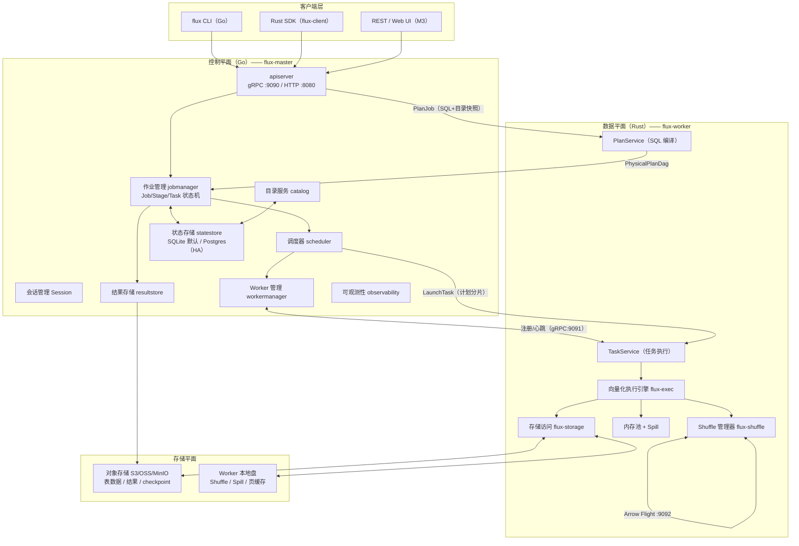
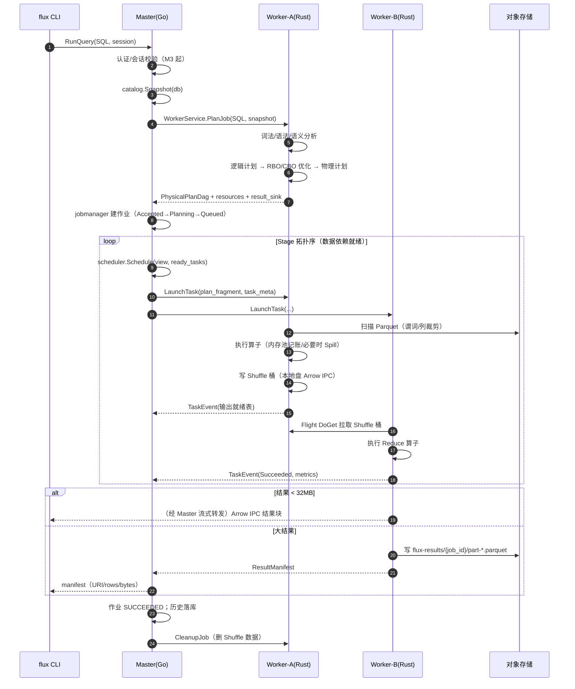
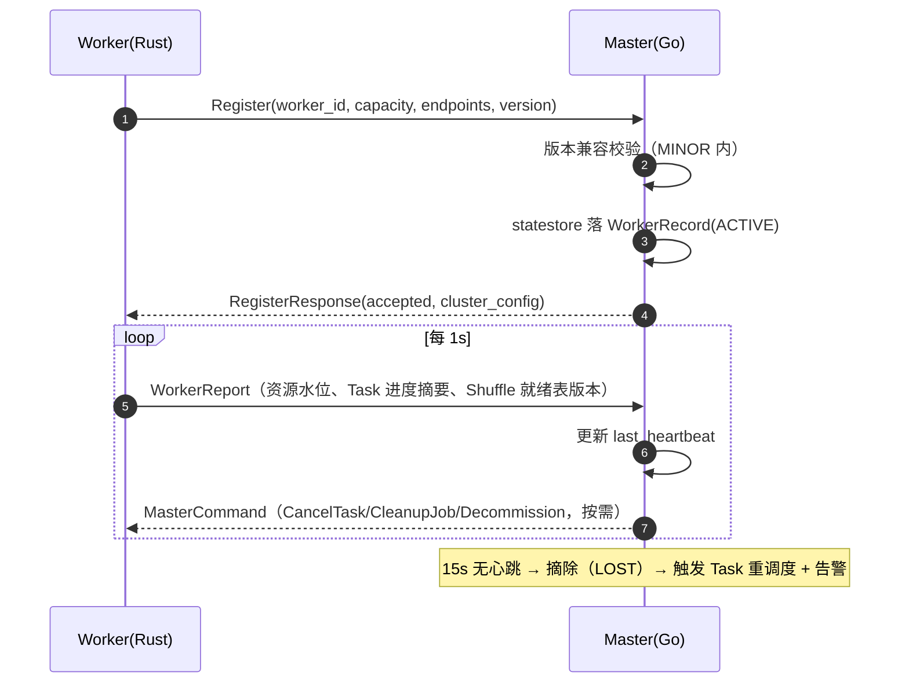
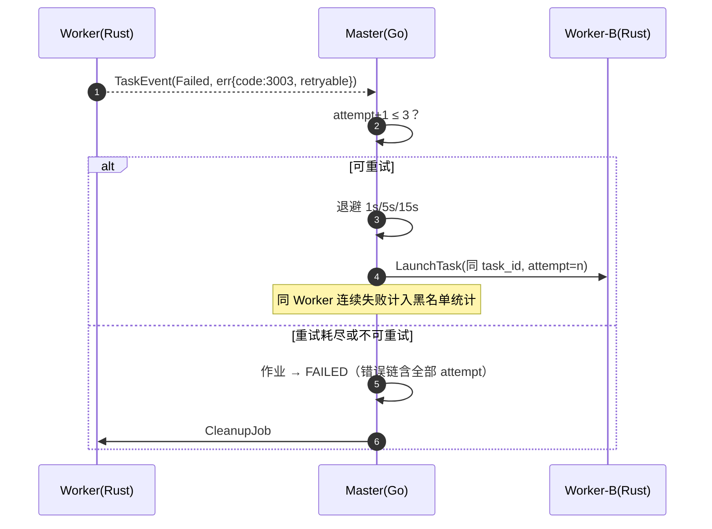
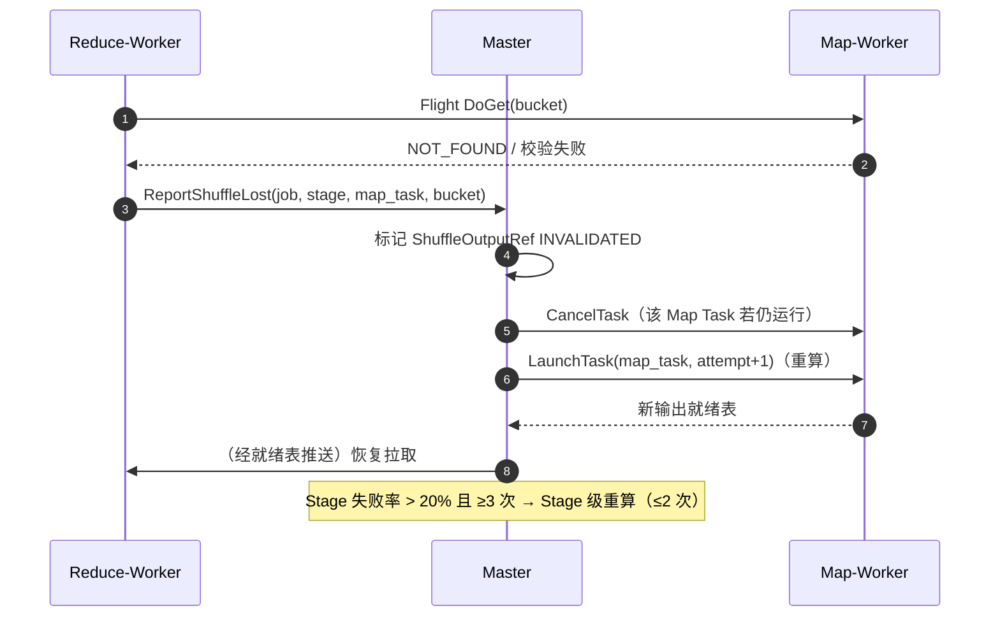
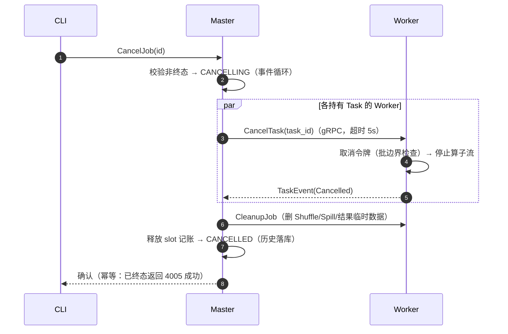
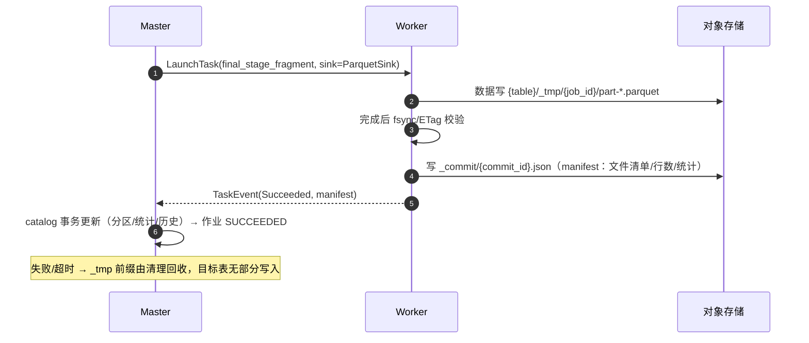
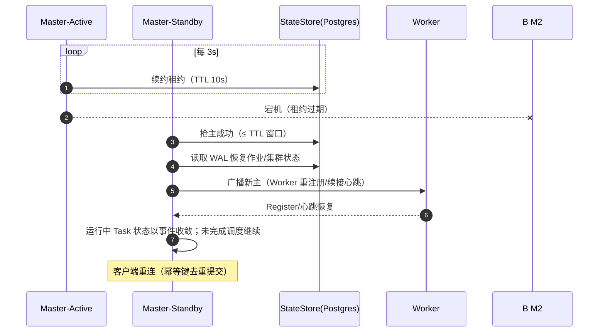
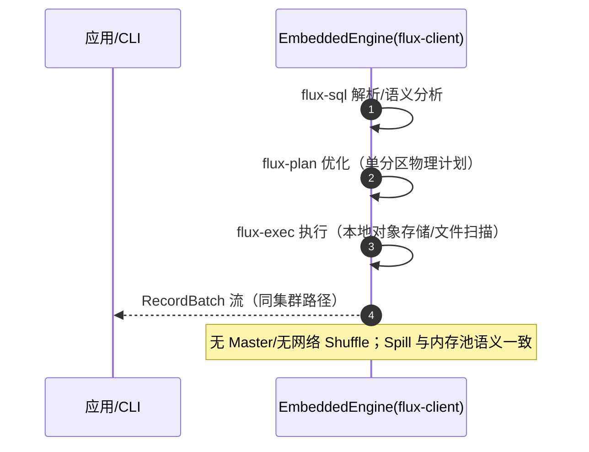
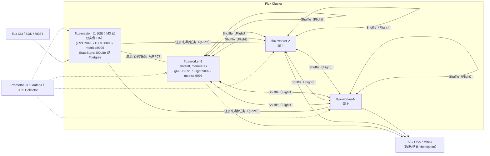

# Flux 概要设计说明书（HLD）

| 文档属性 | 内容 |
| --- | --- |
| 文档版本 | v0.3（传输架构变更：ADR-011） |
| 文档状态 | 待评审 |
| 更新日期 | 2026-09-01 |
| 相关文档 | [SRS](01-软件需求规格说明书.md)、[详细设计说明书](04-详细设计说明书.md)、[架构与代码维护文档](05-架构与代码维护文档.md) |

> 阅读指引：本文档定义 Flux 的总体架构——组件与边界（第 3 章）、关键决策（第 4 章 ADR）、模块清单与接口（第 5–6 章）、关键流程（第 7 章）、数据与容错设计（第 8–9 章）、部署（第 10 章）。模块内部实现细节见详细设计说明书。

## 1. 引言

### 1.1 编写目的

给出 Flux 的总体架构：组件划分、Go/Rust 职责边界、关键设计决策（ADR）、模块间接口概要、关键流程、部署形态与数据流，作为详细设计与编码的顶层依据。

### 1.2 设计输入

- 需求基线：《软件需求规格说明书》v0.2。
- 既定决策：全面对标 Spark（分阶段）；Rust 完全自研内核；自研 Master/Worker 独立集群；对象存储优先。

### 1.3 文档约定

- 组件/接口名使用代码标识符（英文）；RPC 以 `Service.Method` 表示。
- 需求追溯以 `FR-xxx` / `NFR-xxx` 编号引用（见 SRS）。
- 架构规则以 `AR-x` 编号引用（见架构与代码维护文档）。

## 2. 设计总原则

1. **数据面/控制面分离**：Rust 只做数据（计算），Go 只做管控（调度/集群/目录）。边界是进程级 + IPC 传输（同机共享内存、跨机网络，ADR-011），不是库级 FFI（AR-1/AR-2）。
2. **开放标准作为兼容面**：SQL（ANSI 基线）、Parquet（落盘）、Arrow IPC（内存与交换）、gRPC/Protobuf（控制流）、OpenTelemetry/Prometheus（可观测）。
3. **存算分离**：计算节点无状态化（状态仅 Shuffle/Spill 临时数据），数据与结果都在对象存储。
4. **正确性优先于性能，性能优先于功能广度**：每阶段先锁正确性基线（TPC-H + 语义测试集），再扩功能。
5. **可演进性**：内核抽象（计划 DAG + 批处理）须能承载后续流式（微批）与迭代计算（ML/图）而不推翻重构。
6. **单一职责的 Master**：Master 不理解 SQL 与算子语义；其可见物仅为序列化物理计划与资源请求（保证语言边界可执行）。

## 3. 总体架构

### 3.1 架构总览

### 3.2 架构要点

1. **SQL 编译发生在数据面**：Master 收到 SQL 后，选择一个 Worker 调用 `WorkerService.PlanJob`，完成"解析 → 逻辑计划 → 优化 → 物理计划"，返回可序列化的 `PhysicalPlanDag`（protobuf）。Master 只按 DAG 调度，不解析 SQL、不理解算子语义（AR-1/AR-3）。
2. **计划即契约**：`flux.v1.PhysicalPlan`（proto）是 Rust 内核对 Go 调度器的唯一可见物；计划携带资源请求（slots/内存）与结果 sink 描述。
3. **Shuffle 走数据面直连**：Worker 之间传输 Shuffle 数据不经 Master——同机走本地盘/页缓存（无网络），跨机走 Arrow Flight；大结果由最终 Stage 直写对象存储。
4. **同机零回环（ADR-011）**：任何 Go↔Rust 链路同机通信一律共享内存 IPC（控制 shm 环形缓冲 + 数据 shm Arrow 零拷贝），**禁止 TCP 回环**；网络端口只服务跨机场景。
5. **控制流与数据流分离的故障域**：Master 故障不影响运行中 Task 的数据面；Worker 故障由 Master 感知并重调度。

### 3.3 组件职责表

| 组件 | 语言 | 形态 | 职责 | 关键需求 |
| --- | --- | --- | --- | --- |
| flux-master | Go | 常驻进程（M3 起支持双实例 HA） | 集群管理、作业全生命周期、调度、目录/元数据、API/UI、可观测聚合 | FR-CL、FR-OP |
| flux-worker | Rust | 常驻进程 | SQL 编译（PlanService）、Task 执行、Shuffle 收发、内存/Spill、自监控 | FR-B、FR-C、FR-O |
| flux CLI | Go | 客户端 | 交互式 SQL、DDL、作业管理、doctor 巡检 | FR-B10 |
| flux-client | Rust | 库/SDK | 单机直驱（嵌入式执行）与集群提交 | FR-B09 |
| Flux Operator | Go | 后期（M7） | K8s CRD 管理 Master/Worker，弹性伸缩 | FR-CL05 |

### 3.4 Go/Rust 边界铁律（强约束）

1. Go 与 Rust 之间的消息契约只有两种形态：**gRPC/Protobuf（控制流：注册、心跳、计划、任务指令、状态）** 与 **Arrow IPC（数据流：Shuffle、结果块）**（AR-1）。
2. **传输铁律（ADR-011）**：契约与传输解耦——**同机通信一律共享内存 IPC**（控制流 shm 环形缓冲承载 RPC 帧 + 数据流 shm Arrow 零拷贝区域），**禁止 TCP 回环（127.0.0.1）**；gRPC over TCP 与 Arrow Flight 仅用于**跨机**场景。共享内存是 IPC 而非 FFI，进程边界与故障域隔离不变。
3. 禁止任何形式的 FFI（cgo 调 Rust / Rust 调 Go；Go 构建 CGO_ENABLED=0）（AR-2）。
4. Rust 侧不引入集群管理依赖（etcd/k8s client 等）；Go 侧不引入数据处理依赖（arrow/parquet 计算）（AR-3）。
5. 共享契约（错误码、指标名、计划结构）只定义于 `proto/`，双侧生成，禁止手抄两份（AR-4）。

### 3.5 进程间通信矩阵（传输后端选择）

| 链路 | 同机 | 跨机 |
| --- | --- | --- |
| Master(Go) ↔ Worker(Rust) | **shm**（控制 ring + Arrow 零拷贝区域） | gRPC + Arrow Flight |
| Go CLI ↔ 本地引擎（单机模式） | **shm**（CLI 派生引擎子进程，全程无 TCP） | —（不适用） |
| Worker(Rust) ↔ Worker(Rust)（Shuffle） | 本地盘/页缓存直读（无网络） | Arrow Flight |
| Client ↔ Master | UDS 端点（可选）/ TCP | TCP（gRPC/REST） |

降级链（同机）：shm → UDS（`unix://`，仍非 TCP）→ 两者均不可用才允许 TCP（须暴露告警指标）；Windows 开发环境使用命名共享内存/命名管道适配层。shm 布局与协议细节见[详细设计 12.6 节](04-详细设计说明书.md)。

## 4. 关键设计决策（ADR）

> 完整 ADR 索引与维护规则见[架构与代码维护文档第 3 节](05-架构与代码维护文档.md#3-adr架构决策记录流程)。此处为概要与理由。

### ADR-001 双语言架构：Go 控制面 + Rust 数据面

- **决策**：集群管理/调度/服务化用 Go；执行引擎/优化器/解析器用 Rust。
- **理由**：控制面的核心能力是并发服务、K8s 生态亲和、快速迭代（Go 强项）；数据面的核心能力是内存控制、零开销抽象、SIMD（Rust 强项）。GC 停顿在控制面可接受（调度延迟 100ms 级容忍），在数据面不可接受。
- **代价**：跨语言契约维护成本（proto 先行缓解）；两条工具链与人才要求。
- **备选方案**：全 Rust（放弃 Go 控制面生态与团队效率）；全 Go（无法满足 NFR-PERF-3/8）；Go+C++（FFI 链路更重，维护成本更高）。

### ADR-002 复用数据格式标准，自研计算内核

- **决策**：SQL 解析器、优化器、执行器、Shuffle 协议完全自研；复用 Arrow 内存格式（arrow-rs 类型与 IPC 编解码）、Parquet 编解码（arrow-parquet）、对象存储客户端（object_store）、异步与 RPC 基础库（tokio/tonic）。
- **理由**：Arrow 是数据格式标准而非执行引擎，采用它获得生态互操作（Flight/IPC/零拷贝交换）且不束缚内核设计；完全自研内核保证性能天花板与长期演进自由。
- **明确不引入**：DataFusion（计划/执行框架）、Ballista（分布式层）——避免内核路线被第三方架构锁定（依赖白名单由 AR 守护）。

### ADR-003 自研 Master/Worker 独立集群

- **决策**：以自管集群为第一部署形态（对标 Spark Standalone），Master 单点起步、HA 为 M3；K8s Operator 后置 M7。
- **理由**：目标用户（中小团队、存量物理机/虚机）不依赖 K8s；自管协议简单可控（注册/心跳/槽位）。
- **代价**：多租户/配额体系需自建（M4）。

### ADR-004 存算分离、对象存储优先

- **决策**：数据与结果默认在 S3 兼容对象存储（Parquet）；Worker 本地盘仅存 Shuffle/Spill 临时数据；大结果写对象存储返回 URI，小结果流式返回。
- **理由**：贴合云上成本模型；计算无状态化是弹性与容错的前提。

### ADR-005 常驻进程 + 池化执行（非 process-per-task）

- **决策**：Worker 为常驻进程，内部以专用执行线程池运行 Task，slot 为资源单位；IO（网络/文件）走独立异步 runtime。
- **理由**：对标 Spark 常驻 Executor 模式；避免进程启动开销（NFR-PERF-5）；进程内统一内存池记账（AR-8 配套）。
- **隔离性代价**：Task 崩溃可能影响同进程 Task → panic 边界隔离（catch_unwind + 连续崩溃自杀重启）补偿（详细设计 3.3.6）。

### ADR-006 Shuffle：本地盘 Arrow IPC + 按需拉取（pull 模式）

- **决策**：Map 端各 reduce 桶写本地盘（Arrow IPC 文件，zstd 可选）；Reduce 端经 Arrow Flight 按需拉取或本地直读；Shuffle 直写对象存储作为弹性选项（P2）。
- **理由**：pull 模式容错友好（上游重算后可重拉）；Arrow IPC 免行式序列化；本地盘吞吐/成本优于全网络中转。
- **备选**：纯推模式（低延迟但容错差）、全对象存储 Shuffle（弹性最好但延迟与成本差）。

### ADR-007 元数据与状态存储：内嵌起步、可外置

- **决策**：Master 状态抽象 `StateStore` 接口，默认内嵌 SQLite（WAL 模式单文件），生产 HA 可选 Postgres；Master HA 依赖外置存储 + 租约选主。
- **理由**：保持"单二进制开箱即用"；同时给高可用留路径。

### ADR-008 单机嵌入式模式与集群模式共用同一内核

- **决策**：`flux-client` 可不经 Master 直接驱动 `flux-plan + flux-exec` 在本进程执行（单机模式）；集群模式仅多出"计划分发与 Shuffle 走网络"。
- **理由**：开发/测试提效；产品多形态复用同一代码路径，避免两套实现。

### ADR-011 Go↔Rust 同机通信：共享内存 IPC，禁止 TCP 回环

- **决策**：Go 与 Rust 的消息契约（Protobuf 控制流 + Arrow IPC 数据流）与传输载体解耦。**同机通信一律共享内存 IPC**：控制流在 shm 环形缓冲上承载 RPC 帧（eventfd 通知）；数据流在 shm Arrow 零拷贝区域传递（生产者写、消费者按引用读，元数据环形缓冲同步）。gRPC over TCP 与 Arrow Flight 仅用于跨机场景。
- **理由**：默认部署（每节点 Master 邻置或 CLI 直驱本地引擎）中，Go↔Rust 走 TCP 回环引入无谓的双份协议栈开销（回环拷贝、socket 缓冲、上下文切换），高并发 Task 指令与 Shuffle 控制下成为吞吐与延迟瓶颈；shm 帧传递 + eventfd 唤醒将同机开销降到接近进程内水平，且彻底避开回环端口资源与连接数上限。
- **代价**：自研 IPC 层（帧协议、生命周期、对端崩溃回收）——由两侧共享的 `flux-shmipc`（Rust crate）/`shmipc`（Go 包）封装，接口对上层与 gRPC 客户端同构；跨机/同机需运行时探测与降级链。
- **边界澄清**：共享内存是 IPC 不是 FFI——无跨语言调用栈、无共享运行时；进程边界、故障域隔离与全部 AR 规则不变。**禁止 FFI 依旧（AR-2）**。
- **备选方案**：纯 TCP 回环（简单但性能上限低，被否）；UDS（无 TCP 栈但仍有序列化与内核拷贝，作为降级保留）；io_uring 收发（Linux 限定且不解决双拷贝，未采纳）。
- **影响面**：详细设计 12.6（shm 协议）；Rust 新 crate `flux-shmipc`、Go 新包 `internal/shmipc`；IPC 传输配置键（`ipc.transport`）；NFR 新增同机指令延迟指标；SRS 2.4 约束更新。

## 5. 模块清单与接口

### 5.1 Rust workspace（engine/）

> 依赖方向（AR-5）：`worker/client → plan/exec/shuffle → sql/storage → common`，禁止反向与循环。每模块给出：职责 / 提供的接口 / 依赖 / 对应需求。

#### flux-common

- 职责：错误码（`FluxError` + proto 枚举）、配置加载（TOML+env+flag 合并）、指标常量、ID 生成（ULID）、通用工具。
- 提供接口：`FluxError`、`ErrorCode`、`Retryability`、`ConfigLoader<T>`、`idgen` 模块。
- 依赖：无（叶子 crate）。
- 需求：横切（FR-C05 错误语义、配置）。

#### flux-sql

- 职责：SQL 词法分析（Lexer）、语法分析（递归下降 Parser）、AST、语义分析（名称解析/类型检查）、绑定输出（类型化逻辑计划输入）。
- 提供接口：`Lexer`、`Parser::parse_statement`、`Analyzer::analyze(ast, CatalogSnapshot) -> AnalyzedStatement`（含类型化 `Expr`/`Query`）、`Token`/`Span` 诊断类型。
- 依赖：flux-common。
- 需求：FR-B01–B06、FR-B03（子查询绑定）。
- 关键约束：不做优化；错误信息必含行列位置与修复建议（SRS UC-01 A1）。

#### flux-plan

- 职责：逻辑计划（`LogicalPlan`）、优化器（规则框架 + CBO）、物理计划（`PhysicalPlan`）与代价模型、计划序列化（proto）、EXPLAIN 输出。
- 提供接口：`LogicalPlan`、`PhysicalPlan`、`Optimizer`（`Rule` trait 注册）、`Statistics`/`Cost`、`to_proto/from_proto`、`explain`。
- 依赖：flux-sql（类型）、flux-storage（Scan 元信息：分区/统计）、flux-common。
- 需求：FR-O01–O06、FR-B07。

#### flux-exec

- 职责：向量化执行引擎——算子框架（`ExecOperator`）、表达式编译与求值、聚合状态（`Accumulator`）、内存池与 Spill、Task 上下文。
- 提供接口：`ExecOperator::execute(&TaskContext) -> SendableRecordBatchStream`、`MemoryPool`（`try_acquire/release`）、`SpillHandle`、`FunctionRegistry`（函数注册）、`TaskContext`。
- 依赖：flux-plan、flux-storage、flux-common。
- 需求：FR-C01–C04/C06–C08、FR-B05（函数执行）。

#### flux-storage

- 职责：对象存储/本地文件统一抽象（object_store 路由）、Parquet 读写封装（下推/投影/统计）、CSV/JSON 读、提交协议（临时前缀 + manifest）、footer 缓存。
- 提供接口：`ObjectStoreRegistry`、`ParquetSource`（`scan(spec) -> stream`）、`ParquetSink`（`write_commit(plan)`）、`commit_manifest` 协议、`DataSource` trait（未来 HDFS/JDBC/Iceberg 实现点）。
- 依赖：flux-common。
- 需求：FR-A04–A08、FR-A09（提交原子性）。

#### flux-shuffle

- 职责：分区器（Hash/Range/Broadcast/Single）、Map 端写（桶文件管理）、Reduce 端读（本地直读 + Flight 拉取）、Flight 服务端、清理。
- 提供接口：`Partitioner` trait、`ShuffleWriter`、`ShuffleReader`、`FlightDataService`、`ShuffleManager`（输出就绪表上报）。
- 依赖：flux-exec（批类型）、flux-storage（本地盘 IO）、flux-common。
- 需求：FR-C03、FR-C05（ShuffleLost）。

#### flux-worker

- 职责：Worker 进程入口与生命周期——gRPC 服务（`WorkerService`）、Flight 数据服务、心跳、Task 管理器（slot 信号量 + 线程池 + 状态机）、PlanService（调 flux-sql/flux-plan 完成编译）、自监控。
- 提供接口：进程二进制；对 Master 暴露 gRPC `flux.v1.WorkerService`；对 Worker 暴露 Flight。
- 依赖：上述全部 crate。
- 需求：FR-CL01/02（注册心跳）、FR-C01（执行）。

#### flux-client

- 职责：SDK——`LocalSession`（嵌入式直驱）与 `ClusterSession`（gRPC 提交）；DataFrame 风格 API（P1）。
- 提供接口：`LocalSession::open/execute`、`ClusterSession::connect/execute/submit/cancel`、结果流消费。
- 依赖：flux-sql/plan/exec（单机）、tonic（集群）。
- 需求：FR-B09/B10、UC-10。

### 5.2 Go module（control/）

> 依赖方向（AR-10）：`cmd → internal/*`；internal 内 `apiserver → jobmanager → scheduler/workermanager → statestore/catalog`，禁止反向。模块间面向消费侧接口（AR-11）。

#### internal/apiserver

- 职责：gRPC MasterService 实现、HTTP 网关（REST/Web UI 静态资源）、会话管理、认证中间件（P1）、限速。
- 提供接口（对内消费）：`SubmitJob/RunQuery/CancelJob/CatalogOps` 编排（调 jobmanager/catalog）；`SessionStore`。
- 依赖：jobmanager、catalog、config、observability。
- 需求：FR-B10/B11、FR-SEC02、FR-OP04。

#### internal/jobmanager

- 职责：作业状态机（单一事件循环，AR-12）、PlanJob 编排（选 Worker 调用）、Stage/Task 生命周期、重试与重算决策（含黑名单）、结果收集与 resultstore 交接、作业历史。
- 提供接口（消费方视角）：`Submit(ctx, JobSpec) (JobId, error)`、`Cancel(id)`、`Watch(id) -> EventStream`、`Get(id)`。
- 依赖：scheduler、workermanager、statestore、resultstore、proto 客户端。
- 需求：FR-C01/C05/C06、FR-OP05。

#### internal/scheduler

- 职责：纯函数化调度决策——就绪 Stage 选择、Task→Worker 放置（局部性加权）、公平性（P1）。
- 提供接口：`Schedule(cluster ClusterView, ready []StageTask) []Placement`（无副作用，便于单测）。
- 依赖：无（纯逻辑）。
- 需求：FR-C02、FR-CL02/03。

#### internal/workermanager

- 职责：Worker 注册/心跳/摘除/黑名单/优雅下线、集群视图快照（不可变，AR-13）、版本兼容校验。
- 提供接口：`View() ClusterView`、`Blacklist(id)`、`Decommission(id)`、事件订阅（供 jobmanager）。
- 依赖：statestore（持久记录）、config。
- 需求：FR-CL01/04、UC-06/07。

#### internal/catalog

- 职责：库/表/分区/统计元数据管理、DDL 校验与执行、目录快照生成（供 PlanJob）、ANALYZE 编排。
- 提供接口：`Snapshot(db) CatalogSnapshot`、`ApplyDDL(stmt) DDLResult`、`Analyze(table, partitions)`、`Resolve(uri)`。
- 依赖：statestore。
- 需求：FR-A01–A03、FR-O04。

#### internal/statestore

- 职责：持久化接口族——`JobRepo/CatalogRepo/WorkerRepo`；SQLite（默认）与 Postgres 双实现；schema 迁移。
- 提供接口：上述 Repo 接口 + `Migrate()`、`Lease`（选主租约，P1）。
- 依赖：config。
- 需求：FR-A02（持久）、FR-CL06、NFR-REL-2。

#### internal/resultstore

- 职责：大结果写对象存储（经计划 sink，本模块负责 manifest 落库与 URI 管理）、结果 TTL 治理。
- 需求：FR-C07。

#### internal/observability

- 职责：Prometheus 指标注册、OTel 初始化、slog 配置、trace 上下文注入 gRPC metadata。
- 需求：FR-OP01–03。

#### internal/config

- 职责：配置模型（结构体 + TOML/env/flag 合并）、校验与默认值。
- 需求：横切。

#### cmd/flux-master、cmd/flux

- 装配层：显式构造依赖注入（无框架）；CLI 命令树。

### 5.3 接口契约（proto/）——服务清单

| 服务 | 方向 | 用途 | 方法数 | 传输（同机默认 / 跨机） |
| --- | --- | --- | --- | --- |
| `flux.v1.MasterService` | Client → Master | 查询/作业/目录/集群管理 | 22（清单见第 6.2 节） | UDS/shm · TCP gRPC |
| `flux.v1.WorkerService` | Master → Worker | 注册/心跳/编译/任务/清理 | 9 | **shm ring** · TCP gRPC |
| `flux.v1.FlightDataExchange` | Worker ↔ Worker | Shuffle 数据拉取 | 1 | 同机免传（本地盘直读） · Arrow Flight |

完整 proto 定义见[详细设计说明书第 5 章](04-详细设计说明书.md#5-跨语言契约)。

## 6. 接口清单（概要）

### 6.1 客户端 → Master（MasterService）方法表

| 方法 | 类型 | 功能 | 关键错误码 | 幂等 |
| --- | --- | --- | --- | --- |
| RunQuery | 服务端流 | 同步查询，流式返回结果块 | 1xxx/3xxx/4006 | request_id 去重 |
| SubmitJob | 一元 | 异步作业提交 | 同上 | 幂等键 |
| GetJob / ListJobs | 一元 | 状态查询 | 4004 | 天然 |
| CancelJob | 一元 | 取消 | 4004/4005 | 幂等 |
| WatchJob | 服务端流 | 进度事件流 | 4004 | — |
| Explain | 一元 | 三级计划 | 1xxx | 天然 |
| QueryResult | 一元 | 结果 manifest 获取 | 4004 | 天然 |
| CreateDatabase/DropDatabase | 一元 | 库管理 | 1009 类 | 幂等（IF EXISTS） |
| CreateTable/DropTable/AlterTable | 一元 | 表管理 | 同上 | 同上 |
| ListTables/DescribeTable/ListPartitions | 一元 | 元数据查询 | 4004 | 天然 |
| AnalyzeTable | 一元 | 统计收集 | 5xxx | 重复无害 |
| SetSession/CloseSession | 一元 | 会话设置 | 6xxx | 幂等 |
| GetClusterInfo / ListWorkers | 一元 | 集群信息 | — | 天然 |

### 6.2 Master → Worker（WorkerService）方法表

| 方法 | 类型 | 功能 | 关键错误码 |
| --- | --- | --- | --- |
| Register | 一元 | 注册（容量/端点/版本） | 4008（版本不兼容） |
| Heartbeat | 双向流 | 上报资源/进度/就绪表；接收指令（CancelTask/CleanupJob 等） | — |
| PlanJob | 一元 | SQL + 目录快照 → PhysicalPlanDag + 资源请求 | 1xxx/2xxx |
| LaunchTask | 一元 | 派发计划分片 | 4002/4003 |
| CancelTask | 一元 | 取消 Task | 幂等 |
| WatchTask | 服务端流 | Task 事件（状态/指标/完成） | — |
| CleanupJob | 一元 | 删除该作业 Shuffle 数据 | 幂等 |
| Decommission | 一元 | 优雅下线指令 | — |
| ReportShuffleLost | 一元 | Shuffle 丢失上报（亦可经 Heartbeat） | — |

### 6.3 Worker ↔ Worker（FlightDataExchange）

Arrow Flight `DoGet(FlightDescriptor{job_id, stage, map_task, bucket}) → RecordBatch 流`（Arrow IPC）。校验：调用方 Worker 身份（P1 mTLS）。

## 7. 关键流程

### 7.1 SQL 查询端到端

### 7.2 Worker 注册与心跳

### 7.3 Task 失败与重试

### 7.4 Shuffle 丢失重算

### 7.5 作业取消

### 7.6 CTAS/INSERT 原子提交

### 7.7 Master HA 切换（M3）

### 7.8 单机模式（嵌入式）

## 8. 数据设计概要

| 数据类别 | 载体 | 生命周期 | 一致性要点 |
| --- | --- | --- | --- |
| 目录元数据 | Master StateStore（SQLite/Postgres） | 持久 | DDL 串行事务；快照读隔离（PlanJob 输入恒定） |
| 作业/Stage/Task 状态 | Master 内存 + StateStore（WAL 追加） | 终态转历史（保留 7 天） | 单一事件循环写（AR-12）；重启从 WAL 重放 |
| 表数据 | 对象存储 Parquet | 用户管理 | 作业级原子（manifest 提交协议） |
| Shuffle 中间数据 | Worker 本地盘 Arrow IPC | 作业终态即删（TTL 24h 兜底） | 就绪表版本化；丢失可重算 |
| Spill 数据 | Worker 本地盘 Arrow IPC | Task 结束即删 | — |
| 大结果 | 对象存储 `flux-results/` | TTL 默认 7 天 | manifest 与文件一致 |
| 统计信息 | StateStore（col_stats） | ANALYZE 刷新 | stale 标记回退启发式 |

数据模型字段级定义见 SRS 第 5 章数据字典；Shuffle/Spill 文件格式见详细设计第 6 章。

## 9. 容错设计（故障模式与响应）

| 故障模式 | 检测机制 | 响应动作 | 恢复语义 | 验证 |
| --- | --- | --- | --- | --- |
| Worker 进程崩溃/节点宕机 | 心跳超时 15s | 摘除（LOST）→ Task 重排队重试 | Task 级 at-least-once 重算；Shuffle 输出失效标记 | AT-M2-02 |
| Worker 网络分区（短暂） | 心跳缺失但不摘除（<15s） | 恢复后续接 | 无影响 | 混沌注入 |
| Shuffle 桶文件丢失/损坏 | Flight 拉取 404/校验失败 | ReportShuffleLost → 上游 Map 重算 | 精确重算（代价：阶段内部分重跑） | AT-M2-03 |
| Task panic（Rust） | catch_unwind 捕获 | 错误 3999 + Worker 存活上报；连续 panic（3 次/分钟）自杀重启 | 进程级隔离降级 | 单测+混沌 |
| Task OOM（预算内不可 spill） | MemoryPool try_acquire 失败 | 3001 错误 → Master 降并行度重试一次 | 作业尽量自愈 | 内存限制用例 |
| Master 崩溃（M2 单点） | 客户端连接断开 | 重启后从 WAL 恢复集群视图；运行作业标记 UNKNOWN → 用户重提（幂等键） | 作业不静默丢失 | 集成测试 |
| Master 崩溃（M3 HA） | 租约过期 | 备节点 ≤30s 接管 | 运行作业继续；无重复执行 | AT-M3 |
| StateStore 不可用 | 写入失败/超时 | Master 拒绝新提交（降级只读状态查询），告警 | 恢复后自动续写 | 故障注入 |
| 对象存储 5xx/限流 | 客户端重试统计 | 指数退避重试（3 次）→ 明确 5xxx | 作业级重试 | 故障注入 |
| 本地盘写满 | spill/shuffle 写失败 | 5003 错误；作业失败（可诊断） | 换节点重试 | 故障注入 |
| Worker 版本不兼容 | 注册校验 | 拒绝注册（4008） | 无影响 | 兼容矩阵测试 |

**一致性总纲**：数据面重算均为确定性（同一计划分片对同一输入产生相同输出）；作业级 exactly-once 语义由"重试 + 幂等提交（manifest）"达成；流式阶段（M5）在此基础上叠加 checkpoint。

## 10. 部署设计

### 10.1 自研集群（第一阶段形态）

- 部署单元：每节点一个静态二进制 + 一份 TOML 配置；systemd 单元或容器封装均可（无特权要求）。
- 拓扑：Master 与 Worker 分节点（`--dev` 支持混部开发模式）。
- 升级：滚动（Worker 逐个 drain → 替换 → 注册），Master 后升级；兼容窗口见架构维护文档 5.2。

### 10.2 单机嵌入式模式

`flux sql --local`（CLI）或 `LocalSession`（SDK）直接驱动 Rust 引擎；数据可本地文件或对象存储；用于开发、测试与轻量场景（UC-10）。

### 10.3 容量与端口规划

| 项 | 默认 | 说明 |
| --- | --- | --- |
| Worker slots | CPU 核数 | 每 slot ≈ 1 核 + task 内存预算 |
| Worker 内存池 | 容器/机器限额 × 85% | 或显式 total |
| Shuffle/Spill 盘 | 独立挂载点推荐 | 容量 ≈ 2× 单作业峰值中间数据 |
| 集群规模 | 单 Master ≤ 200 Worker | 超出后分集群（P2+） |

端口表见 SRS 2.3；全部配置键见详细设计第 10 章。

## 11. 性能设计概要

- **向量化 + 列式**：全链路 `RecordBatch`（默认 8192 行/批），表达式按列求值，禁逐行虚调用（AR-7/8）。
- **零拷贝路径**：Parquet 解码 → Arrow 缓冲 → 算子 → Arrow IPC Shuffle，全程无行式转换。
- **异步 IO 与预取**：扫描/Spill/Shuffle 拉取走独立 IO runtime，计算线程不阻塞（AR-7）。
- **内存纪律**：统一内存池 + Task 配额 + Spill 优先于 OOM；记账到算子级。
- **SIMD**：表达式/聚合热路径利用 Arrow compute 内核与受控 intrinsics（unsafe 白名单，AR-9）。
- **基准门禁**：每 PR 微基准（>5% 回归说明）、每夜 TPC-H 10GB（>3% 报警）、每版本集群基准（NFR 对标报告）。

## 12. 安全设计概要

- M3：全链路 TLS（Master/Worker/Flight/Client）+ 静态 Token 认证；`flux admin cert/token` 工具链。
- 凭证隔离：对象存储凭证仅 Worker 侧持有，不上报 Master、不落日志（FR-SEC05）。
- M4+：mTLS、RBAC（库/表级）、审计日志（哈希链）。
- 纵深：默认内网监听、认证失败限速、错误信息不含内部路径细节。

## 13. 需求追溯矩阵

| 需求 | 承载模块 | 关键设计 | 验证 |
| --- | --- | --- | --- |
| FR-B01–B06（SQL 前端） | flux-sql | 手写解析器 + 语义分析（ADR-002） | AT-M1-01/02 |
| FR-B07（EXPLAIN） | flux-plan | 计划序列化与渲染 | golden |
| FR-B09/B10（SDK/CLI） | flux-client、cmd/flux | ADR-008 双模式 | AT-M1-05 |
| FR-O01–O06（优化） | flux-plan | 规则框架 + CBO | golden 计划 |
| FR-C01–C04（执行/内存） | flux-exec、flux-worker | 向量化内核 + 内存池/Spill（ADR-005） | AT-M1-04 |
| FR-C03（Shuffle） | flux-shuffle | 本地盘 IPC + Flight 拉取（ADR-006） | NFR-PERF-7 |
| FR-C05（容错） | jobmanager + workermanager | 重试/重算/黑名单（第 9 章） | AT-M2-02/03 |
| FR-C06（取消） | jobmanager + Worker | 取消令牌传播 | AT-M2-05 |
| FR-C07（结果） | resultstore + flux-storage | manifest 协议（7.6） | 集成 |
| FR-A01–A09（数据） | flux-storage、catalog | object_store 抽象 + 原子提交（ADR-004） | 互操作 CI |
| FR-CL01–CL04（集群） | workermanager、apiserver | 注册/心跳/槽位（ADR-003） | AT-M2-04 |
| FR-CL06（HA） | statestore + master | 租约选主（ADR-007、7.7） | AT-M3 |
| FR-OP01–06（可观测） | 两侧 observability | Prometheus/OTel/slog | 链路树测试 |
| FR-SEC01/02 | apiserver + Worker | TLS/Token（第 12 章） | AT-M3 |

## 14. 架构演进视图（与路线图对应）

| 阶段 | 架构增量 | 新增 ADR/设计 |
| --- | --- | --- |
| M1 | 单进程内核（sql/plan/exec/storage）+ CLI 直驱（shm IPC） | ADR-008/011 |
| M2 | + Master(Go)、Worker 进程化、proto 契约、shm IPC 主链路、跨机 Flight 兜底 | ADR-001/003/006/011 |
| M3 | + StateStore 外置/HA、TLS/Token、Web UI、OTel | ADR-007 |
| M4 | + 连接器矩阵（HDFS/JDBC/Iceberg）、多租户配额 | DataSource 扩展 |
| M5 | + 流式：Source/Sink 抽象、Checkpoint、微批调度复用 | 预留 ADR-009（流式抽象） |
| M6 | + 迭代计算：BSP 执行原语、ML/Graph 库 | 预留 ADR-010（迭代执行） |
| M7 | + K8s Operator（CRD）、自动扩缩容 | — |

## 15. 变更记录

- v0.1（2026-09-01）：初稿。
- v0.2（2026-09-01）：细化稿——模块清单扩展为"职责/提供接口/依赖/需求"四元组；新增 RPC 方法级清单（3 张表）；时序图从 1 张扩至 8 张（注册心跳/重试/Shuffle 丢失/取消/原子提交/HA 切换/单机模式）；新增故障模式响应矩阵（11 类）；部署设计与追溯矩阵补全。
- v0.3（2026-09-01）：**ADR-011 传输架构变更**——Go↔Rust 同机通信改为共享内存 IPC（控制 shm 环形缓冲 + 数据 shm Arrow 零拷贝），禁止 TCP 回环；网络仅用于跨机；新增 3.5 进程间通信矩阵与降级链；边界铁律、服务清单、演进视图同步更新。
