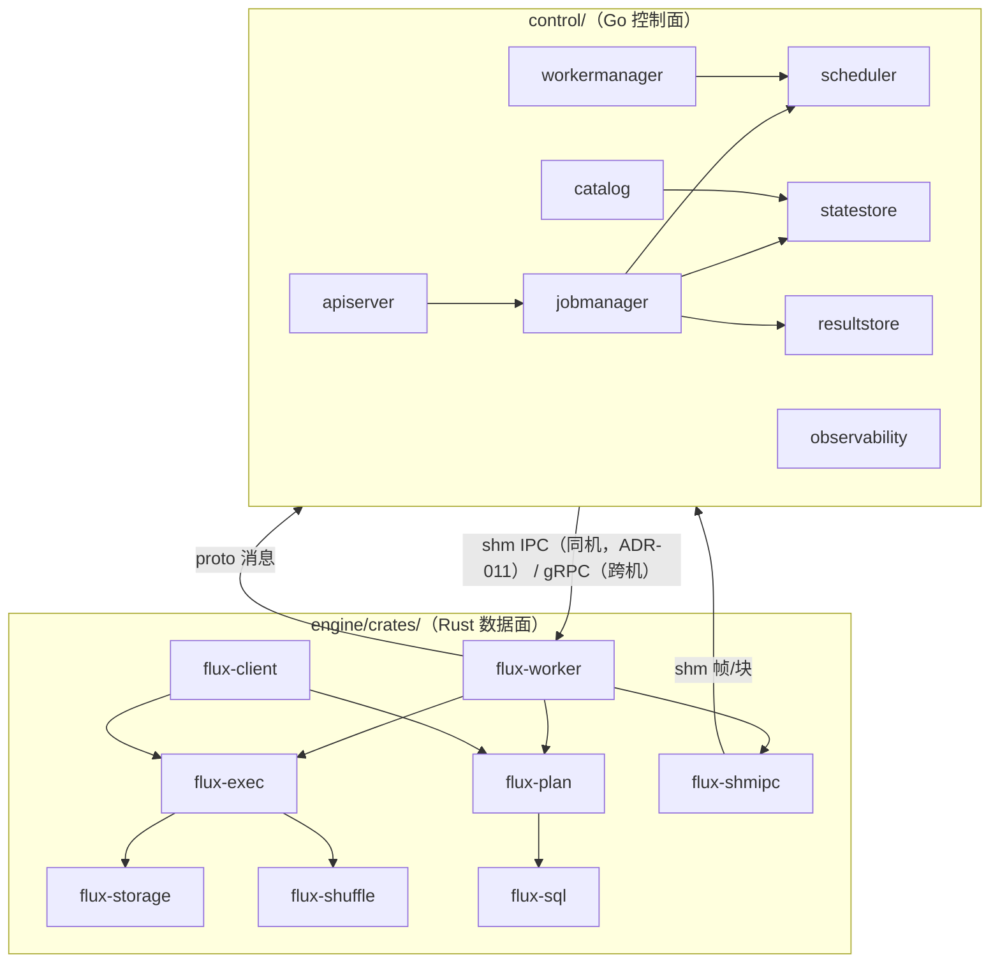

# Flux 详细设计说明书（LLD）

| 文档属性 | 内容 |
| --- | --- |
| 文档版本 | v0.3（ADR-011：shm IPC 传输） |
| 文档状态 | 待评审 |
| 更新日期 | 2026-09-01 |
| 相关文档 | [概要设计说明书](03-概要设计说明书.md)（总体结构与 ADR 依据） |

> 阅读指引：本文档是对概要设计的逐模块展开，给出接口签名、数据结构、算法与流程的**实现级规格**。约定：代码标识符英文；接口签名为设计契约，实现以最小必要偏差同步更新本文档；标 (P1)/(P2) 的条目为对应里程碑交付。

## 目录

1. [模块总览](#1-模块总览)
2. [公共基础（flux-common）](#2-公共基础)
3. [SQL 前端（flux-sql）](#3-sql-前端flux-sql)
4. [类型系统与函数目录](#4-类型系统与函数目录)
5. [计划与优化（flux-plan）](#5-计划与优化flux-plan)
6. [执行引擎（flux-exec）](#6-执行引擎flux-exec)
7. [Shuffle（flux-shuffle）](#7-shuffleflux-shuffle)
8. [存储访问（flux-storage）](#8-存储访问flux-storage)
9. [Worker 进程（flux-worker）](#9-worker-进程flux-worker)
10. [Rust SDK（flux-client）](#10-rust-sdkflux-client)
11. [Go 控制面（control/）](#11-go-控制面control)
12. [跨语言契约（proto）](#12-跨语言契约proto)
13. [文件格式与磁盘布局](#13-文件格式与磁盘布局)
14. [指标目录](#14-指标目录)
15. [配置参考全表](#15-配置参考全表)
16. [安全实现](#16-安全实现)
17. [测试设计](#17-测试设计)

## 1. 模块总览



## 2. 公共基础

### 2.1 错误码全集

定义于 `proto/flux/v1/errors.proto`（枚举 `flux.v1.ErrorCode`），双侧生成。段位：`1xxx` 语法/语义、`2xxx` 计划/优化、`3xxx` 执行、`4xxx` 集群/调度、`5xxx` 存储/IO、`6xxx` 安全、`7xxx` 配置/内部。`R` 列：`Y`=可重试，`N`=不可重试（作业直接失败），`S`=系统级重试（Master 换节点）。

| 码 | 名称 | 含义 | R |
| --- | --- | --- | --- |
| 1001 | SYNTAX_ERROR | 语法错误（含行列位置） | N |
| 1002 | LEX_ERROR | 词法错误（非法字符/未闭合字符串） | N |
| 1003 | UNDEFINED_OBJECT | 未定义的库/表/列/函数 | N |
| 1004 | AMBIGUOUS_REFERENCE | 歧义列/对象引用 | N |
| 1005 | TYPE_MISMATCH | 类型不匹配（无可用转换） | N |
| 1006 | FUNCTION_NOT_FOUND | 函数不存在 | N |
| 1007 | INVALID_ARGUMENT_COUNT | 参数数量错误 | N |
| 1008 | INVALID_LITERAL | 非法字面量（越界/格式） | N |
| 1009 | UNSUPPORTED_SYNTAX | 保留字/未实现语法 | N |
| 1010 | NAME_ALREADY_EXISTS | 对象已存在（无 IF NOT EXISTS） | N |
| 2001 | INVALID_LOGICAL_PLAN | 逻辑计划非法（分析阶段之后的不变式破坏） | N |
| 2002 | OPTIMIZER_FAILURE | 优化器内部错误 | N |
| 2003 | UNSUPPORTED_OPERATOR | 物理算子不支持该输入形态 | N |
| 2004 | PLAN_TOO_LARGE | 计划超限（节点数 > 10000） | N |
| 2005 | STATISTICS_MISSING | 需要统计信息但缺失且无回退 | N |
| 3001 | MEMORY_LIMIT_EXCEEDED | Task 内存预算耗尽且不可 Spill | S |
| 3002 | SHUFFLE_DATA_LOST | Shuffle 数据丢失（内部转为重算，透出时为耗尽） | S |
| 3003 | DATA_SOURCE_ERROR | 数据源读失败（重试后仍失败） | Y |
| 3004 | CORRUPT_FILE | 文件格式损坏（校验失败） | S |
| 3005 | CODEC_ERROR | 编解码错误 | N |
| 3006 | NUMERIC_OVERFLOW | 数值溢出/精度丢失超限 | N |
| 3007 | DIVISION_BY_ZERO | 除零 | N |
| 3008 | ARRAY_INDEX_OUT_OF_BOUNDS | 数组越界 | N |
| 3009 | EXRESSION_EVAL_ERROR | 表达式求值错误（如 CAST 失败） | N |
| 3101 | STREAM_TIMEOUT | 流读取超时 | Y |
| 3999 | TASK_PANIC | Task panic（catch_unwind 捕获） | S |
| 4001 | WORKER_LOST | Worker 失联（Master 侧语义） | S |
| 4002 | INSUFFICIENT_RESOURCES | 资源不足（调度内部排队，透出仅超时） | — |
| 4003 | WORKER_BLACKLISTED | 目标 Worker 黑名单 | — |
| 4004 | JOB_NOT_FOUND | 作业/对象不存在 | N |
| 4005 | INVALID_JOB_STATE | 作业状态冲突（如重复取消） | N |
| 4006 | QUEUE_TIMEOUT | 排队超时 | N |
| 4007 | MASTER_UNAVAILABLE | Master 不可用（HA 切换中） | Y |
| 4008 | VERSION_INCOMPATIBLE | 版本不兼容（注册拒绝/计划版本过高） | N |
| 4009 | TASK_ALREADY_FINISHED | Task 已终态（幂等冲突） | N |
| 5001 | OBJECT_STORE_ERROR | 对象存储操作失败 | Y |
| 5002 | CREDENTIAL_ERROR | 凭证无效/无权限 | N |
| 5003 | LOCAL_IO_ERROR | 本地盘 IO 失败（spill/shuffle） | S |
| 5004 | RESULT_EXPIRED | 结果已过期清理 | N |
| 6001 | AUTH_FAILED | 认证失败 | N |
| 6002 | PERMISSION_DENIED | 权限不足（M4） | N |
| 6003 | TLS_ERROR | TLS 握手/证书错误 | N |
| 7001 | INVALID_CONFIG | 配置非法 | N |
| 7002 | SERIALIZATION_ERROR | 序列化/反序列化失败 | N |
| 7003 | INTERNAL_INVARIANT_VIOLATED | 内部断言失败（bug，带追踪号上报） | N |

Rust 侧承载结构：

```rust
pub struct FluxError {
    code: ErrorCode,          // proto 枚举
    retryable: Retryability,  // Retryable | Fatal
    message: String,          // 面向用户，含上下文（表/列/分区），不含堆栈
    source: Option<Box<dyn std::error::Error + Send + Sync>>,
    span: Option<Span>,       // 1xxx 错误必填
    trace: Vec<String>,       // 上下文链（“在扫描 s3://a/b 时”）
}
```

Go 侧：`fluxerr.Code(err) ErrorCode`、`fluxerr.IsRetryable(err) bool`；wrap 用 `%w`；重试决策只看 code + retryable。

### 2.2 ID 与命名规范

| 对象 | 格式 | 示例 |
| --- | --- | --- |
| Job | `job_<ulid 小写>` | `job_01j8zq3w9xk...` |
| Stage | `s{idx}`（作业内） | `s0`、`s3` |
| Task | `{stage_idx}-{partition}-{attempt}` | `3-17-0` |
| Worker | `w_<uuidv4>` | `w_9f8c...` |
| Session | `sess_<uuidv4>` | — |
| Commit | `cmt_<ulid>` | — |
| Shuffle 桶 | 见第 13 章 | — |
| 指标 | `flux_master_*` / `flux_worker_*` | — |

时间戳统一 UTC Unix 毫秒（i64）；追踪上下文 W3C `traceparent`，经 gRPC metadata `x-flux-trace` 传播。

### 2.3 配置系统

- 优先级：CLI flag > 环境变量（`FLUX_<SECTION>_<KEY>`，嵌套用 `_`）> TOML 文件 > 默认值。
- 机制：各结构体实现 `Default`；`ConfigLoader<T>::load()` 完成合并与校验（校验失败 = 7001，启动即退出并列出全部非法项）。
- 全量键表见第 15 章。

## 3. SQL 前端（flux-sql）

### 3.1 职责与边界

输入 SQL 文本，输出经名称解析与类型检查的**类型化分析结果**（`AnalyzedStatement`：逻辑计划输入或 DDL 描述）。不做优化。错误信息必含行列位置与建议（SRS UC-01 A1）。

### 3.2 词法分析（Lexer）

产出 `Token { kind: TokenKind, span: Span }`；`Span { offset: u32, len: u32, line: u32, col: u32 }`。实现为 `Iterator<Item = Result<Token, FluxError>>`。

**TokenKind 全表**：

| 类别 | 种类 |
| --- | --- |
| 字面量 | `INTEGER`（i64/u64 越界转 `DECIMAL`）、`FLOAT`、`DECIMAL`（含 `1.5e3`）、`STRING`（单引号，`''` 转义与 `E'...'`）、`BINARY_LITERAL`（`X'AF'`）、`TRUE/FALSE`、`NULL`、`INTERVAL` 前缀、`DATE '...'`、`TIMESTAMP '...'`、`TIME '...'` |
| 标识符 | `IDENT`（未引号，折叠小写）、`QUOTED_IDENT`（双引号或反引号，保留大小写） |
| 关键字 | 保留字表见 3.3 文法（大小写不敏感） |
| 操作符 | `+ - * / % = <> != < <= > >= || ( ) , . [ ] ::` |
| 注释 | `--` 行注释、`/* */` 块注释（词法层丢弃，保留换行计数） |

数值字面量规则：整数字面量默认 INT64；超出 i64 → DECIMAL(38,0)；小数 → DECIMAL（按位推导 p/s，上限 38）；科学计数 → FLOAT64。

### 3.3 语法分析（Parser，递归下降）

**文法（EBNF，`[]` 可选、`{}` 重复、`|` 或；大写为关键字）：**

```ebnf
sql_input      ::= statement ( ";" statement )* [ ";" ] ;

statement      ::= query_stmt | ddl_stmt | dml_stmt
                | explain_stmt | set_stmt | use_stmt | show_stmt | describe_stmt ;

(* ---- 查询 ---- *)
query_stmt     ::= [ with_clause ] query_body [ order_by ] [ limit_clause ] ;
with_clause    ::= "WITH" [ "RECURSIVE" ] with_item { "," with_item } ;
with_item      ::= ident [ "(" ident_list ")" ] "AS" "(" query_stmt ")" ;
query_body     ::= query_term { set_op query_term } ;
set_op         ::= "UNION" [ "ALL" ] | "INTERSECT" [ "ALL" ] | "EXCEPT" [ "ALL" ] ;   (* INTERSECT/EXCEPT: P1 *)
query_term     ::= "SELECT" [ "DISTINCT" | "ALL" ] select_item { "," select_item }
                   [ "FROM" table_ref { "," table_ref } ]
                   [ "WHERE" search_cond ]
                   [ "GROUP" "BY" group_item { "," group_item } ]
                   [ "HAVING" search_cond ] ;
select_item    ::= "*" | qualified "." "*" | expr [ [ "AS" ] ident ] ;
group_item     ::= expr | "GROUPING" "SETS" "(" ... ")" ;                              (* GROUPING SETS: P2 *)

order_by       ::= "ORDER" "BY" sort_item { "," sort_item } ;
sort_item      ::= expr [ "ASC" | "DESC" ] [ "NULLS" ( "FIRST" | "LAST" ) ] ;
limit_clause   ::= "LIMIT" expr [ "OFFSET" expr ] | "LIMIT" expr "," expr ;           (* 第二式 MySQL 风格 P1 *)

table_ref      ::= table_primary { join_clause } ;
table_primary  ::= table_name [ "TABLESAMPLE" "(" expr "%" ")" ]                     (* P2 *)
                 | "(" query_stmt ")" [ [ "AS" ] alias [ "(" ident_list ")" ] ]
                 | table_name "(" [ func_args ] ")" [ [ "AS" ] alias ]                (* 表函数，P1 *)
                 | "VALUES" "(" expr_list ")" { "," "(" expr_list ")" } [ alias ] ;    (* P1 *)
join_clause    ::= [ "INNER" | "LEFT" | "RIGHT" | "FULL" ] [ "OUTER" ] | "CROSS" ] "JOIN"
                   table_primary [ "ON" search_cond | "USING" "(" ident_list ")" ] ;
table_name     ::= ident | ident "." ident ;

(* ---- 表达式（Pratt 优先级爬升） ---- *)
expr           ::= boolean_or ;
boolean_or     ::= boolean_and { "OR" boolean_and } ;
boolean_and    ::= boolean_not { "AND" boolean_not } ;
boolean_not    ::= [ "NOT" ] predicate ;
predicate      ::= arith_expr [ comparison ] ;
comparison     ::= ( "=" | "<>" | "!=" | "<" | "<=" | ">" | ">=" ) arith_expr
                 | "IS" [ "NOT" ] "NULL"
                 | [ "NOT" ] "IN" "(" ( query_stmt | expr_list ) ")"
                 | [ "NOT" ] ( "LIKE" | "ILIKE" ) arith_expr [ "ESCAPE" arith_expr ]
                 | [ "NOT" ] "BETWEEN" arith_expr "AND" arith_expr
                 | [ "NOT" ] "RLIKE" arith_expr ;
arith_expr     ::= term { ( "+" | "-" | "||" ) term } ;
term           ::= factor { ( "*" | "/" | "%" ) factor } ;
factor         ::= [ "-" | "+" ] primary [ "::" type_name ] ;                          (* :: 显式 cast *)
primary        ::= literal | column_ref | func_call | window_func | case_expr
                 | "(" expr ")" | "(" query_stmt ")" | array_constructor
                 | "EXISTS" "(" query_stmt ")" | "CAST" "(" expr "AS" type_name ")"
                 | "TRY_CAST" "(" expr "AS" type_name ")"
                 | "EXTRACT" "(" date_part "FROM" expr ")" ;
column_ref     ::= ident | ident "." ident | ident "." ident "." ident ;              (* [db.]table.col *)
func_call      ::= ident "(" [ [ "DISTINCT" ] expr_list ] ")" [ "[" expr "]" ] ;       (* 尾部下标 P1 *)
window_func    ::= func_call "OVER" window_spec | ("ROW_NUMBER"|"RANK"|"DENSE_RANK"
                 | "NTILE"|"LAG"|"LEAD"|"FIRST_VALUE"|"LAST_VALUE") "(" args ")" "OVER" window_spec ; (* P1 *)
window_spec    ::= "(" [ ident ] [ partition_by ] [ order_by ] [ frame_clause ] ")" ; (* P1 *)
case_expr      ::= "CASE" ( simple_case | searched_case ) "END" ;
array_constructor ::= "ARRAY" "[" expr_list "]" ;                                      (* P1 *)
```

**表达式优先级表**（低 → 高）：

| 级 | 操作符 | 结合性 |
| --- | --- | --- |
| 1 | `OR` | 左 |
| 2 | `AND` | 左 |
| 3 | `NOT` | 一元 |
| 4 | `IS NULL`、`IN`、`LIKE`、`BETWEEN`、比较 | 不可结合 |
| 5 | `||`（拼接） | 左 |
| 6 | `+` `-` | 左 |
| 7 | `*` `/` `%` | 左 |
| 8 | 一元 `-` `+` | 右 |
| 9 | `::`（cast） | 左 |
| 10 | `.`、`[]`、函数调用 | 左 |

**Parser 结构（设计契约）**：

```rust
pub struct Parser<'a> { tokens: Vec<Token>, pos: usize, src: &'a str }
impl<'a> Parser<'a> {
    pub fn new(src: &'a str) -> Result<Self>;                  // 含词法
    pub fn parse_statement(&mut self) -> Result<Statement>;
    pub fn parse_statements(&mut self) -> Result<Vec<Statement>>; // 按 ';' 拆分
    fn parse_query(&mut self) -> Result<Query>;
    fn parse_expr(&mut self) -> Result<Expr>;                  // 入口 min_bp = 0
    fn parse_expr_bp(&mut self, min_bp: u8) -> Result<Expr>;    // Pratt 核心
    fn parse_primary(&mut self) -> Result<Expr>;
    fn expect(&mut self, k: TokenKind) -> Result<Token>;
    fn peek_kind(&self) -> TokenKind;
}
```

错误恢复：报告首个错误即返回（含 span、最近 token、建议候选——编辑距离 ≤ 2 的关键字）；`ParseError` 携带 `expected: Vec<TokenKind>`。

### 3.4 AST

```rust
pub enum Statement {
    Query(Box<Query>),
    Explain { inner: Box<Statement>, mode: ExplainMode },        // Logical|Optimized|Physical|All
    Ddl(DdlStatement),                                            // Create/Drop/Alter/Use/Show/Describe
    Dml(DmlStatement),                                            // Insert{ table, partition?, overwrite, source: Query } | Ctas
    Set { name: String, value: SettableValue },
}

pub struct Query {
    pub with: Vec<CteRef>,
    pub body: SetExpr,                                            // Select | SetOp{op,left,right} | Query(Box<Query>)
    pub order_by: Vec<SortItem>,
    pub limit: Option<LimitClause>,                               // limit + offset
}

pub struct Select {
    pub distinct: bool,
    pub projection: Vec<SelectItem>,                             // UnnamedExpr/ExprWithAlias/Wildcard/QualifiedWildcard
    pub from: Vec<TableRef>,                                      // 逗号连接为 CrossJoin 链
    pub selection: Option<Expr>,
    pub group_by: Vec<Expr>,
    pub having: Option<Expr>,
}

pub enum TableRef { Named{ resolver: ObjectName, alias: Option<Alias> },
                    Derived{ query: Box<Query>, alias: Alias },
                    Join{ left: Box<TableRef>, right: Box<TableRef>, kind: JoinKind, cond: JoinCond } }

pub enum Expr { Literal(ScalarValue), Column(ColumnRef), BinaryOp{op, left, right},
                UnaryOp{op, expr}, Func{ name, args, distinct: bool, over: Option<WindowSpec> },
                Case{ operand: Option<Box<Expr>>, when_then: Vec<(Expr, Expr)>, else_ },
                Cast{ expr, to: DataType, try_: bool }, IsNull{expr, negated},
                InList{expr, list, negated}, InSubquery{expr, sub, negated},
                Exists{sub, negated}, Between{expr, low, high, negated},
                Like{expr, pattern, escape, negated, case_insensitive},
                Subquery(Box<Query>), Array(Vec<Expr>), Interval{value, unit}, Wildcard }
```

### 3.5 语义分析（Analyzer）

```rust
pub struct Analyzer;
pub fn analyze(stmt: Statement, cat: &CatalogSnapshot, session: &SessionSettings)
    -> Result<AnalyzedStatement>;

pub struct AnalyzedStatement {     // 全部 Expr 已类型化
    pub plan: Option<LogicalPlanInput>,   // 查询类：带 Schema 的表达式树
    pub ddl: Option<DdlStatement>,        // 已校验
    pub kind: StatementKind,
}
```

**名称解析**：作用域栈（外→内：CTE → 派生表 → 父查询 → 表），`ColumnRef` 解析为计划列索引；未找到 → 1003；多处命中 → 1004。星号展开发生在分析期（展开为具体列列表，携带列来源供列裁剪）。

**类型检查**：函数签名匹配顺序（精确匹配 → 隐式转换（第 4.2 节矩阵）→ 无匹配 1005/1006）；比较/算术两侧按提升矩阵对齐；GROUP BY/ORDER BY 引用输出别名与序号（`GROUP BY 1`）支持（P1）；`SELECT` 非聚合列必须出现在 GROUP BY（否则 1009，附提示）。

**确定性检查**：非确定函数（`random()`）禁止出现在 CREATE VIEW/流式聚合键（P1）。

## 4. 类型系统与函数目录

### 4.1 DataType

```rust
pub enum DataType {
    Boolean,
    Int8, Int16, Int32, Int64, UInt32, UInt64,
    Float32, Float64,
    Decimal { precision: u8 /*≤38*/, scale: u8 /*≤precision*/ },
    Utf8,                                  // VARCHAR；CHAR(n) 语法接受并按 Utf8 处理（文档化差异）
    Binary,
    Date, Time { unit: TimeUnit }, Timestamp { unit: TimeUnit, tz: TzHint }, // 默认 microsecond；TzHint: Utc|None（会话 time_zone 仅影响显示与解析字面量）
    Interval { kind: IntervalKind },       // YearMonth | DayTime
    Array(Box<DataType>), Struct(Vec<Field>),   // P1
}
```

### 4.2 隐式转换矩阵

`I` = 隐式允许（自动），`E` = 仅显式 CAST，`-` = 不可转换。行=源，列=目标（节选高频组合，完整矩阵代码化为 `cast_matrix.rs` 表驱动测试全量覆盖）：

| 源\目标 | BOOL | INT64 | FLOAT64 | DECIMAL | UTF8 | DATE | TIMESTAMP |
| --- | --- | --- | --- | --- | --- | --- | --- |
| BOOL | I | E | E | E | E | - | - |
| INT8..64 | E | I | I | I | E | - | - |
| FLOAT32/64 | E | E | I | E | E | - | - |
| DECIMAL | E | E | I | I（扩宽） | E | - | - |
| UTF8 | E | E | E | E | I | E | E |
| DATE | - | E | - | - | E | I | I |
| TIME | - | E | - | - | E | - | E |
| TIMESTAMP | - | E | - | - | E | E | I（精度提升） |
| INTERVAL | - | - | - | - | E | - | - |
| NULL | I | I | I | I | I | I | I |

规则补充：
- 整数族内部：有符号窄→宽 I；宽→窄 E；有符号→无符号 E。
- 比较/算术提升链：`INT8→…→INT64→DECIMAL→FLOAT64`；两侧取链上更后者（DECIMAL 与 FLOAT64 比较按 DECIMAL→FLOAT64 转换）。
- `DATE` 与 `TIMESTAMP` 比较：DATE 提升为 TIMESTAMP(0)。
- 字符串到数值/日期的隐式转换**禁止**（需显式 CAST，保证安全）。

### 4.3 NULL 与边界语义

| 场景 | 语义 |
| --- | --- |
| 三值逻辑 | `AND/OR/NOT` 按 SQL 标准；`NULL = NULL` → NULL |
| 聚合 | 忽略 NULL；`COUNT(*)` 计所有行；`COUNT(col)` 忽略 NULL；空集 `SUM→NULL`、`COUNT→0` |
| GROUP BY / DISTINCT | NULL 各自归为同一组/视为相等 |
| ORDER BY | 默认 ASC NULLS LAST / DESC NULLS FIRST，可显式覆盖 |
| 等值 JOIN | NULL 键不匹配 |
| IN (列表) | 含 NULL 且无匹配 → NULL（三值） |
| 算术溢出 | 整数报 3006；FLOAT → INF（IEEE）；DECIMAL 按 SQL 精度规则四舍五入 |
| 除零 | 报 3007（不返回 NULL，显式可诊断） |
| CAST 失败 | `CAST` 报 3009；`TRY_CAST` 返回 NULL |

### 4.4 内置函数目录（M1 交付 ⊆ 下表；标注 P1 者后续里程碑）

**字符串（返回值均为 NULL 传播除注明）**

| 函数 | 签名 | 返回 | 备注 |
| --- | --- | --- | --- |
| length / char_length | (utf8) → int64 | 字符数 | octet_length 字节数 |
| upper / lower | (utf8) → utf8 | — | — |
| trim / ltrim / rtrim / btrim | (utf8[, utf8]) → utf8 | 去空白或指定字符集 | 双向默认 |
| substr / substring | (utf8, int64[, int64]) → utf8 | start 1 起，负数从尾部 | 长度越界钳制 |
| left / right | (utf8, int64) → utf8 | — | n≤0 返回空串 |
| lpad / rpad | (utf8, int64, utf8) → utf8 | — | — |
| replace | (utf8, utf8, utf8) → utf8 | 全部替换 | — |
| split_part | (utf8, utf8, int64) → utf8 | 1 起索引，越界空串 | — |
| concat | (any...) → utf8 | NULL 跳过（非传播） | ≥2 参数 |
| concat_ws | (utf8, any...) → utf8 | NULL 跳过 | sep 为 NULL → NULL |
| position / strpos | (utf8, utf8) → int64 | 子串位置，0 未命中 | — |
| starts_with / ends_with | (utf8, utf8) → bool | — | — |
| repeat | (utf8, int64) → utf8 | — | — |
| reverse | (utf8) → utf8 | — | — |
| chr / ascii | (int64)/(utf8) → utf8/int64 | — | — |
| to_hex / to_binary | (int64/utf8) → utf8/binary | — | — |
| md5 / sha256 | (utf8|binary) → utf8 | — | P1 |
| regexp_like | (utf8, utf8[, utf8]) → bool | flags: i/c/m/s | P1 |
| regexp_replace | (utf8, utf8, utf8[, utf8]) → utf8 | — | P1 |
| regexp_extract | (utf8, utf8[, int64]) → utf8 | 组号默认 1 | P1 |
| lcase/ucase 等 | 别名 | — | 兼容别名表维护 |

**数学**

| 函数 | 签名 | 返回 |
| --- | --- | --- |
| abs | (numeric) → same | — |
| sign | (numeric) → int64 | -1/0/1 |
| ceil / floor | (numeric) → 对应整型/float | — |
| round / trunc | (x[, int64 d]) → same | half-up（DECIMAL）/banker's（FLOAT，注明） |
| mod | (int64, int64) → int64 | 符号随被除数 |
| pow / power | (float64, float64) → float64 | — |
| sqrt / cbrt / exp / ln / log / log2 / log10 | (float64) → float64 | log(x)=ln（Spark 对齐，文档声明） |
| sin/cos/tan/asin/acos/atan/atan2/sinh/cosh/tanh | float | P1 |
| pi / radians / degrees | ()/float64 → float64 | — |
| rand / random | () → float64 | 非确定，禁入视图/流键 |

**日期时间**

| 函数 | 签名 | 返回 | 备注 |
| --- | --- | --- | --- |
| current_date | () → date | 查询内恒定 | — |
| current_timestamp / now | () → timestamp | 查询内恒定 | — |
| extract / date_part | (part, date|time|ts) → int64 | year/quarter/month/week/day/dayofweek/dayofyear/hour/minute/second/millisecond/microsecond/epoch | week ISO 规则（文档声明） |
| date_trunc | (part, ts) → ts | 支持到 second | — |
| date_add / date_sub | (date, int64) → date | 天数 | — |
| datediff | (date, date) → int64 | end−start 天数 | — |
| last_day / next_day | (date[, utf8]) → date | — | next_day P1 |
| to_date | (utf8[, fmt]) → date | 失败报 3009 | 无 fmt 按会话默认格式 |
| to_timestamp | (utf8[, fmt]) → ts | 同上 | — |
| to_char / date_format | (ts, utf8) → utf8 | — | — |
| unix_timestamp | (ts) → int64 | 秒 | — |
| from_unixtime | (int64[, fmt]) → utf8 | — | — |

**条件 / 转换 / 系统**

| 函数 | 说明 |
| --- | --- |
| CASE（简单/搜索） | 标准语义 |
| coalesce(a, ...) | 首个非 NULL |
| nullif(a, b) | a=b → NULL |
| if(cond, a, b) / ifnull(a, b) / nvl | — |
| greatest / least | 忽略 NULL；全 NULL → NULL |
| CAST / TRY_CAST / `::` | 见 4.2/4.3 |
| version() / current_user() | — |

**聚合**（窗口聚合 P1 复用同实现）

| 函数 | 聚合类型 | 备注 |
| --- | --- | --- |
| count(*) / count(x) / count(distinct x) | — | distinct 经 Shuffle 两阶段精确去重 |
| sum | INT→INT64（溢出检查）/DECIMAL 精确/FLOAT | 空集 NULL |
| avg | 数值 | DECIMAL 精确除法 |
| min / max | 全序类型 | — |
| stddev_samp / stddev_pop / var_samp / var_pop | float | P1 |
| bool_and / bool_or | bool | P1 |
| approx_distinct | HyperLogLog（误差 ~1.6%） | P2 |
| collect_list / collect_set | array | P2 |
| first / last(x, ignore_nulls) | — | P2 |

**窗口（P1）**：`row_number/rank/dense_rank/percent_rank/cume_dist/ntile/lag/lead/first_value/last_value/nth_value` + 聚合窗口（sum/avg/count/min/max）；frame：`ROWS|RANGE BETWEEN ... AND ...`（支持 UNBOUNDED/N CURRENT ROW/n PRECEDING/FOLLOWING）；默认 frame：排名函数无 frame，聚合 `RANGE UNBOUNDED PRECEDING..CURRENT ROW`。

## 5. 计划与优化（flux-plan）

### 5.1 逻辑计划

```rust
pub struct LogicalPlan {
    pub kind: PlanKind,
    pub schema: SchemaRef,          // 输出列（name/type/nullable + ColumnId 血缘）
    pub stats: PlanStats,            // 预估行数/宽度（优化过程填充）
}

pub enum PlanKind {
    Scan { source: ScanSource, projection: Vec<ColumnId>, pushed: Vec<Expr> },
    Filter { input: Arc<LogicalPlan>, predicate: Expr },
    Project { input: Arc<LogicalPlan>, exprs: Vec<Expr>, names: Vec<String> },
    Aggregate { input: Arc<LogicalPlan>, group: Vec<Expr>, aggs: Vec<AggCall> },
    Join { left: Arc<LogicalPlan>, right: Arc<LogicalPlan>,
           kind: JoinKind, on: Vec<(Expr, Expr)>, filter: Option<Expr> },   // on=等值键对，filter=残余条件
    Sort { input: Arc<LogicalPlan>, keys: Vec<SortKey> },
    Limit { input: Arc<LogicalPlan>, skip: u64, fetch: Option<u64> },
    Repartition { input: Arc<LogicalPlan>, spec: RepartitionSpec },          // Shuffle 边界
    Distinct { input: Arc<LogicalPlan> },                                    // 语义=Aggregate(全部列)
    SetOp { kind: SetOpKind, all: bool, left, right },
    Window { input: Arc<LogicalPlan>, frames: Vec<WindowFrame> },            // P1
    CteScan { cte_id: CteId, projection: Vec<ColumnId> },
    Values { rows: Vec<Vec<Expr>> },                                         // P1
}
```

不变式（构造器与测试共同守护）：
1. 每节点 `schema` 与子节点 schema 一致可推导；
2. Filter 谓词引用列必在输入 schema；
3. Aggregate 非分组列不可泄漏到 Project 之外被直接引用；
4. `Repartition` 是唯一跨 Worker 边界节点。

### 5.2 优化器

```rust
pub trait Rule: Send + Sync {
    fn name(&self) -> &'static str;
    fn apply(&self, plan: LogicalPlan, ctx: &OptContext) -> Result<Transformed>;
}
pub struct Optimizer { rules: Vec<Arc<dyn Rule>> }   // 固定顺序执行一轮（M3 起支持迭代至不动点，上限 3 轮）
```

**规则表**（执行顺序即下列顺序；guard 不满足时原样返回）：

| # | 规则 | 模式 | 变换 | Guard | 版本 |
| --- | --- | --- | --- | --- | --- |
| 1 | ConstantFolding | 全树表达式 | 编译期求值纯函数常量子树 | 函数确定性 | M1 |
| 2 | BooleanSimplify | 布尔表达式 | De Morgan、`true AND x→x`、`x OR true→true`、双重否定消除 | — | M1 |
| 3 | PredicateMerge | Filter(Filter) | 合并为 AND | — | M1 |
| 4 | PredicatePushdown | Filter over Project/Join/Aggregate/Sort/Limit | 谓词沿输入推向 Scan；Join 按列归属拆分两侧；外连接侧谓词仅推保留侧 | 推后语义等价（NULL 拒绝谓词才可推过 OUTER） | M1 |
| 5 | ColumnPruning | 自顶向下收集所需列 | 各节点投影收缩到引用集 | — | M1 |
| 6 | ProjectionCollapse | Project(Project) | 合并内联表达式 | 无副作用列 | M1 |
| 7 | LimitPushdown | Limit over Union/Sort/Project | 下推（Sort 保留） | — | M1 |
| 8 | DistinctToAggregate | Distinct | 转聚合（统一路径） | — | M1 |
| 9 | EliminateSort | Sort(无键) / Limit(∞) | 移除 | — | M1 |
| 10 | SimplifyJoinCast | Join 键两侧类型不一致 | 插入最小 CAST | — | M1 |
| 11 | DecorrelateSubquery | InSubquery/Exists（相关） | Semi/Anti Join | 相关列可提升 | P1 |
| 12 | CommonCteInline | CteScan 多引用 | 物化/内联决策 | 引用数 ≥ 2 物化 | P1 |
| 13 | JoinReorder（DP） | 多表 Join 链 | 表序枚举（≤8 DP，>8 贪心） | 有统计 | M3 |
| 14 | BroadcastSelection | Join | 分区 Join→Broadcast | 构建端估算 < broadcast_bytes | M2 |
| 15 | AggregateTwoPhase | 大基数聚合 | Partial→Repartition→Final | 输入跨节点 | M1 |

**统计与代价（M3 CBO）**：

```text
行数估计：
  Filter(s)      = child_rows × Π sel(pred_i)，sel 默认 1/3；等值 col=lit 有 NDV → 1/NDV
  Join(等值)     = L×R / max(ndv(l_key), ndv(r_key))
  Join(非等值)   = L×R × 0.25（默认启发式）
  GroupBy        = min(child_rows, Π ndv(group_cols))，无统计 → sqrt(child_rows)
  Distinct       = 同 GroupBy 全列

代价（无量纲，CPU 时间近似）：
  Scan           = rows_out × width_bytes × 0.01 + scan_bytes × 0.02（下推后）
  Filter/Project = rows_in × 0.05
  HashAgg        = groups × 0.2 + rows_in × 0.1
  HashJoin       = build_rows × 0.3 + probe_rows × 0.15
  SMJ            = (l+r) × log(l+r) × 0.1（输入有序时免排序）
  Sort           = n log n × 0.1 × width_factor
  Shuffle        = bytes × 0.5（网络+落盘）
总代价 = Σ 节点代价；选择：同形态计划取最小
```

### 5.3 物理计划

```rust
pub enum PhysicalPlan {
    Scan { spec: ScanSpec },                        // 表/文件列表、投影、下推谓词、输出统计
    Filter { input: Arc<Self>, predicate: CompiledExpr },
    Project { input: Arc<Self>, exprs: Vec<CompiledExpr>, schema: SchemaRef },
    HashAggregate { input: Arc<Self>, mode: AggMode /*Partial|Final*/, group: Vec<CompiledExpr>, aggs: Vec<AggSpec> },
    HashJoin { build: Arc<Self>, probe: Arc<Self>, kind, keys, filter, build_side: Side },
    SortMergeJoin { left, right, keys, kind, filter },                         // M3
    Sort { input: Arc<Self>, keys: Vec<SortKey>, fetch: Option<u64> },         // fetch = TopN 优化
    ShuffleWrite { input: Arc<Self>, spec: ShuffleSpec },                      // Stage 边界（Map 侧）
    ShuffleRead { stage: StageId, spec: ShuffleSpec },                         // Stage 边界（Reduce 侧）
    Broadcast { input: Arc<Self> },                                            // 物化一次全节点可见
    Limit { input: Arc<Self>, skip: u64, fetch: Option<u64> },
    Union { inputs: Vec<Arc<Self>> },
    Values { rows: Vec<Vec<ScalarValue>> },
    Sink { input: Arc<Self>, target: SinkTarget },                             // Parquet 结果/表写
    Window { input, frames },                                                  // P1
}
```

逻辑→物理映射要点：聚合两阶段插入 `Partial → ShuffleWrite(Hash) → ShuffleRead → Final`；Join 选择依据 5.2 代价 + BroadcastSelection；`Sort+Limit` → TopN（堆，内存有界）；最终阶段附 `Sink`（结果流或表写）。

### 5.4 序列化

- `flux.v1.PhysicalPlan`（第 12.3 节 proto）：Stage 列表 + Stage 间 Shuffle 边 + 每 Stage 根算子树 + 资源请求 + sink 描述。
- `plan_version: u32`（从 1 起）；Worker 拒绝高于自身版本（4008）。
- 序列化后大小上限 4MB（超限 2004）；表达式以预序扁平数组编码（节点池共享去重）。
- EXPLAIN 渲染：`树形缩进 + 每节点（算子名 | 关键属性 | 预估行数/代价）`，三种模式（Logical/Optimized/Physical）共享渲染器。

## 6. 执行引擎（flux-exec）

### 6.1 执行模型

- **Pull + 异步流**：算子实现 `ExecOperator`；执行由专用线程逐批拉取，IO 由独立 runtime 预取。

```rust
pub trait ExecOperator: Send + Sync {
    fn schema(&self) -> &SchemaRef;
    fn execute(&self, ctx: &TaskContext) -> Result<SendableRecordBatchStream>;
}
pub type SendableRecordBatchStream = Box<dyn Stream<Item = Result<RecordBatch>> + Send>;
```

- 批大小默认 8192 行（`exec.batch_max_rows`），上限 65536。
- 取消传播：每算子在**批边界**检查 `ctx.cancel`（`CancellationToken`），取消时返回 `Cancelled` 错误（非 panic）。
- 运行时线程拓扑：

```text
┌ 执行线程 ×slots（OS 线程，pull 循环）
│    ↕ 有界 channel（容量 = 并发预取批数，默认 4/算子）
└ IO runtime（tokio，io_threads）：对象存储读 / Flight 拉取 / Spill 读写
```

### 6.2 表达式编译与求值

```rust
pub struct ExprCompiler { registry: Arc<FunctionRegistry> }
impl ExprCompiler {
    pub fn compile(&self, e: &Expr, input: &Schema) -> Result<CompiledExpr>;
}
pub struct CompiledExpr(Arc<dyn Fn(&RecordBatch) -> Result<ArrayRef> + Send + Sync>);
```

- 编译期：常量折叠、公共子表达式消除（同批内哈希去重）、按输入列偏移直索引（无名字查找）。
- 求值按列向量化；标量函数经 `FunctionRegistry`（`scalar: HashMap<&str, ScalarImpl>`，`ScalarImpl: Fn(&[ArrayRef]) -> Result<ArrayRef>`）。
- SIMD：比较/算术/Hash 优先走 arrow compute；手写 intrinsics 需白名单（AR-9）+ criterion 证据。
- 选择率反馈：Filter 执行时统计实际 selectivity，TaskEvent 上报供自适应（P2）。

### 6.3 算子详细设计

**ScanExec（Parquet）**

```text
输入：ScanSpec{ files, projection_cols, pushdown_preds, session }
并发单元 = RowGroup；调度并发度 = min(slots, io_threads)
流程：
  1) 按 footer 缓存取列统计；逐 RowGroup 应用谓词 → row_group_alive
  2) Prefetcher 有界队列（容量 = 4×并发度）异步预读 alive row group
  3) 解码仅投影列 → RecordBatch（转 Arrow，零拷贝缓冲池）
  4) 残余谓词（不可下推部分）Filter 求值
小文件合并：文件 < merge_file_min(16MB) 时按计划级合并并发单元
指标：scan_rows、scan_bytes（实际读取列字节）、row_groups_pruned
```

**HashAggregateExec**

```text
两阶段：Partial（Map 端，局部聚合）→ Shuffle(Hash by group key) → Final
哈希表：key = Row 编码（紧凑行式，仅 key 路径），值 = Accumulator 状态数组
流程（单阶段视角）：
  for batch in input:
      keys = eval(group_exprs, batch)                 # 列式
      encoded = RowEncoder(keys)                      # 去定宽编码
      for (k_idx, row) in encoded:                     # 分组内批处理
          slot = table.lookup_or_insert(row)           # 开放寻址
          accumulators[slot].update_batch(列切片)
  输出：emit (group_keys, accumulator.final())
Spill（池占用超阈值触发）：
  1) 按 key hash 分桶，逐桶序列化为 Arrow IPC（key 列 + 状态列）写盘
  2) 清空对应桶释放内存
  3) 末段：读回各桶与内存表合并（Accumulator.merge_batch，状态可合并）
单 key 超大（distinct 基数 > 内存预算）：进入磁盘归并路径（桶间外部归并）
Accumulator trait：update_batch / merge_batch / state() / finalize() —— Spill 与 Shuffle 复用同一状态格式
```

**HashJoinExec（等值）**

```text
构建端选择：有统计选小侧；无统计默认右；运行时自适应（读首批后置换）P2
构建：
  for batch in build_input:
      keys = eval(build_key_exprs, batch)
      table.insert(RowEncoder(keys), RowPointer{batch_id, offsets})   # 行不物化，存指针
      memory.acquire(batch_nbytes)（超预算 → Grace 分桶落盘）
探测：
  for batch in probe_input:
      keys = eval(probe_key_exprs, batch)
      matches = table.probe(keys)                     # 匹配 batch_id+offsets → gather
      output = emit(batch, matched_build_rows, join_kind)   # LEFT/FULL 处理未匹配侧 + NULL 扩展
Grace 落盘（有界内存保证）：
  1) 构建超预算：按 key hash 分 B 桶（B 指数扩容直至单桶可内存构建）
  2) 探测侧同 hash 桶对齐落盘
  3) 逐桶加载构建→流式探测；B 桶循环完成
指标：build_rows、probe_rows、spill_buckets
```

**SortExec / TopN**

```text
内存内：列式多键比较器（代码生成的分支树），稳定排序
外部归并：
  1) 段（run）= 持续写入直至内存预算；段内排序后 spill 为 Arrow IPC（按 keys 有序）
  2) K 路归并（败者树），K = min(8, 段数)；IO 双缓冲预读
TopN（fetch 有限）：有界堆（容量 fetch+skip），内存恒定，无 spill
```

**FilterExec / ProjectExec / LimitExec / UnionExec**：直译语义（列裁剪与常量折叠已在计划期完成）；Limit 计数在批边界。

### 6.4 内存管理协议

```rust
pub trait MemoryPool: Send + Sync {
    fn try_acquire(&self, bytes: usize) -> Result<Lease>;   // Err = OutOfMemory(3001)
    fn release(&self, lease: Lease);
    fn used(&self) -> usize; fn total(&self) -> usize;
    fn register_spillable(&self, h: SpillHandle);            // 注册可回收算子
    fn on_pressure(&self) -> Vec<SpillHandle>;               // 按注册逆序返回
}
```

- Task 预算 = `clamp(pool_total / slots, task_mem_min, task_mem_max)`；算子持有 RAII `Lease`，批缓冲/表增长前 `try_acquire`。
- 压力路径：占用 ≥ `spill_threshold` → 通知 SpillHandle（异步信号，算子批边界响应）→ `try_acquire` 失败先强制 spill 再重试一次 → 仍失败返回 3001。
- 硬红线：进程 RSS 逼近 `memory.total`（98%）时 Worker 拒绝新 LaunchTask（Busy 响应）。

### 6.5 panic 隔离

- Task 主体 `std::panic::catch_unwind(AssertUnwindSafe(...))`；panic → `FluxError{code: 3999, retryable: Fatal}` 上报；`panic_hook` 记录堆栈与 task_id。
- 滑动窗口（60s）内 ≥ 3 次 panic → Worker `exit(70)`（自杀），由进程管理器（systemd/k8s）拉起；重连后重注册（SRS UC-06）。

## 7. Shuffle（flux-shuffle）

### 7.1 分区器

```rust
pub enum Partitioning {
    RoundRobin,
    Hash { exprs: Vec<CompiledExpr>, buckets: usize },      // xxhash64(encode(keys)) % n；NULL 记入 hash=0
    Range { keys: Vec<SortKey>, bounds: Vec<Row> },          // M3：采样边界表，二分定位桶
    Single,                                                  // 全部入 0 桶
    Broadcast,                                              // 每桶 = 完整副本
}
```

桶数默认：`min(max(集群总 slots × 2, 8), 1024)`；会话 `shuffle_partitions` 覆盖。

### 7.2 写路径（Map 端）

```text
布局：{shuffle_dir}/job-{job_id}/stage-{dst_stage}/map-{task_id}-{attempt}/bucket-{k}.arrow
流程：
  1) 每 bucket 一个 BufferedWriter（缓冲 4MB，Arrow IPC RecordBatch 消息流）
  2) for batch in input: bucket_ids = partitioner.partition(batch) → 按桶切片写
  3) finish：flush + fsync（聚合）→ 计算每桶（bytes、rows、checksum）
  4) 向 Master 上报输出就绪表：[{bucket, bytes, rows, checksum}]（经 TaskEvent）
压缩：`shuffle.compression = zstd(level 1)` 默认开（CPU-网络权衡可配）
背压：写盘队列有界（4×桶数条目），满则阻塞计算线程
```

### 7.3 读路径（Reduce 端）

```text
输入：Master 下发的就绪表视图（含各 Map 输出位置）
  本地桶（同 Worker）：直接文件读（页缓存）
  远端桶：Flight DoGet(descriptor{job,stage,map_task,bucket}) → RecordBatch 流
  并发拉取 = shuffle.concurrent_fetch（默认 8）；失败重试：3 次指数退避（1s/4s/16s）
  校验：bytes/checksum 不符 → 3004 → 上报 ShuffleLost
失效：map_task 无效（重算中）→ 该桶挂起等待新就绪表（Master 推送）
归并：多 map 端流按需消费（不预取全部，内存有界）
```

### 7.4 Flight 服务

`FlightDataStream`：`DoGet(FlightData{job_id, stage, map_task, bucket})` → 校验作业/桶存在且调用方 Worker 在注册表 → 流式返回 Arrow IPC。超时 60s/桶；P1 mTLS 校验对端身份。

### 7.5 清理

作业终态：Master 向各 Worker 发 `CleanupJob`（删除整个 `job-{id}` 目录）；兜底 TTL 扫描（默认 24h）清理孤儿目录（`flux admin cleanup shuffle` 手动触发亦可）。

## 8. 存储访问（flux-storage）

### 8.1 存储抽象

```rust
pub struct ObjectStoreRegistry { stores: HashMap<Scheme, Arc<dyn ObjectStore>> }
// scheme 路由：s3/oss/minio/cos → object_store::AmazonS3（endpoint 定制）
//             file → LocalFileSystem；hdfs → P1
// 每实例配置：endpoint/region/ak/sk/proxy/allow_http（来源优先级：URI 内联 > 表属性 > 全局配置）
pub trait FluxObjectStore {
    async fn list(&self, prefix: &str, wildcard: Option<&str>) -> Result<Vec<FileMeta>>;
    async fn get_range(&self, path: &str, range: Range) -> Result<Bytes>;
    async fn put(&self, path: &str, data: PutPayload) -> Result<()>;
    async fn delete(&self, path: &str) -> Result<()>;
}
pub struct FileMeta { path: String, size: u64, etag: Option<String>, last_modified: Ts }
```

缓存：Parquet footer LRU（键 = path+etag，容量 `storage.cache_size`）；对象属性缓存 TTL 30s。

### 8.2 Parquet 读路径

见 6.3 ScanExec；补充：Schema 演进（文件列 ⊂ 表 Schema）：缺失列补 NULL，多余列忽略；类型冲突 → 3004；时区：Parquet INT96/isAdjustedToUTC → Arrow Timestamp 处理规则文档化。

### 8.3 写路径与提交协议

```text
写：ParquetWriter（row_group_size=128MB，压缩=表属性默认 zstd-3）
    每文件完成即 fsync/ETag 校验；文件级统计（行数/列 min/max/NULL 计数）收集
提交（作业级原子，ADR-004）：
  1) 数据写 {table_loc}/_tmp/{commit_id}/part-{n}.parquet
  2) manifest：{table_loc}/_commit/{commit_id}.json（文件清单+统计+schema 快照）
  3) Master 端 catalog 事务：登记分区/文件清单 → 提交点（此后对外可见）
  4) 删除 _tmp/{commit_id}
INSERT OVERWRITE：新数据 manifest 成功后，旧分区文件标记待删（异步回收）
幂等：同一 commit_id 重放不产生重复（manifest 存在即跳过）
```

### 8.4 CSV / JSON 读

CSV：选项（delimiter/header/quote/escape/null_marker/压缩/Schema 提示或推断）；推断顺序 BOOLEAN→INT64→FLOAT64→UTF8。JSON：换行分隔 JSON（NDJSON），同列推断；复杂值 P2。写：P2。

## 9. Worker 进程（flux-worker）

### 9.1 服务与端口

| 服务 | 端口 | 实现 | 说明 |
| --- | --- | --- | --- |
| WorkerService（gRPC） | 9091 | tonic；Master 调用 | 仅跨机；同机 Master 走 shm（12.6 节，无端口） |
| FlightDataStream（Arrow Flight） | 9092 | tonic-flight；Worker 间 | 仅跨机；同机 Shuffle 本地盘直读 |
| Metrics（HTTP） | 9096 | Prometheus 文本协议 | — |

### 9.2 Task 生命周期（状态机表）

| 当前态 | 事件 | 动作 | 次态 |
| --- | --- | --- | --- |
| — | LaunchTask | 校验资源/slot → 记录 | CREATED |
| CREATED | 执行线程就绪 | 构造 TaskContext、反序列化计划分片 | RUNNING |
| RUNNING | 流自然结束 | Sink 收尾（fsync/manifest）→ TaskEvent(SUCCEEDED, metrics) | SUCCEEDED |
| RUNNING | Err（可重试码） | TaskEvent(FAILED, retryable) | FAILED |
| RUNNING | Err（不可重试码/3999） | TaskEvent(FAILED, fatal) | FAILED |
| RUNNING | CancelTask | 取消令牌 → 停止流 → 回收 | CANCELLED |
| RUNNING | Worker 被摘除 | （Master 侧重排队） | — |
| FAILED | Master 重派 | attempt+1（新实例） | CREATED |
| 任意终态 | CleanupJob | 删除 task 级 spill/shuffle 数据 | （资源回收） |

### 9.3 线程与并发模型

- slot 信号量（计数）控制并发 Task；每 Task 绑定一个执行线程（从池中取）。
- PlanService 编译请求走 IO runtime（不占执行线程）；编译结果缓存（同 SQL+快照哈希，容量 16）。
- 心跳协程 1s：聚合（运行 Task 概要、内存池水位、Shuffle 就绪表版本号）。

## 10. Rust SDK（flux-client）

```rust
pub struct LocalSession { engine: EmbeddedEngine, settings: SessionSettings }
impl LocalSession {
    pub fn open(cfg: EmbeddedConfig) -> Result<Self>;
    pub fn execute(&self, sql: &str) -> Result<QueryResult>;   // QueryResult: SendableRecordBatchStream + schema
    pub fn table(&self, name: &str) -> Result<DataFrame>;      // P1 DataFrame 入口
}

pub struct ClusterSession { channel: tonic::Channel, session_id: SessionId }
impl ClusterSession {
    pub async fn connect(master: &str, auth: AuthToken) -> Result<Self>;
    pub async fn execute(&self, sql: &str) -> Result<QueryResult>;   // RunQuery 流
    pub async fn submit(&self, spec: JobSpec) -> Result<JobHandle>;
    pub async fn cancel(&self, job: &JobId) -> Result<()>;
    pub async fn explain(&self, sql: &str) -> Result<ExplainOutput>;
}
```

DataFrame（P1）：`table/scan/filter/select/aggregate/group_by/join/sort/limit/union → to_logical_plan()`，保证与 SQL 同源计划。

## 11. Go 控制面（control/）

### 11.1 apiserver

- gRPC 实现 `MasterService`（proto 见第 12 章）；REST 网关（grpc-gateway）生成 + 手写薄层。
- 会话：`SessionStore`（内存 + TTL 1h 滑动；ID 经 `x-flux-session` metadata）。
- 认证（P1）：中间件链 `TLS → Token → RBAC(M4)`；限速：令牌桶 100 qps/会话。
- 请求幂等：`request_id`（客户端 ULID）→ 已存在则返回缓存响应（结果流除外，返回 4005 语义）。

### 11.2 jobmanager（状态机与事件循环）

```go
type JobManager interface {
    Submit(ctx context.Context, spec JobSpec) (JobId, error)
    Cancel(id JobId) error
    Watch(id JobId) (<-chan JobEvent, error)
    Get(id JobId) (JobDetail, error)
}
```

- 单 goroutine 事件循环消费 `chan JobEvent`（提交/Worker 事件/定时器），全部状态写路径在此（AR-12）；每次迁移同步 append WAL（StateStore）。
- PlanJob 编排：选 Worker（负载最低且版本兼容）→ 调 `WorkerService.PlanJob` → 失败换 Worker 重试 1 次（SRS 故障矩阵）。

**Job 状态机转换表**：

| 当前 | 事件 | 动作 | 次态 |
| --- | --- | --- | --- |
| — | Submit 校验通过 | 建记录（WAL） | ACCEPTED |
| ACCEPTED | begin_plan | 调 Worker.PlanJob | PLANNING |
| PLANNING | plan_ok | 生成 Stage/Task 描述、入队列 | QUEUED |
| PLANNING | plan_err(1xxx/2xxx) | 记错误链 | FAILED |
| QUEUED | 首 Task 派发 | — | RUNNING |
| RUNNING | Stage 推进 | 更新进度（事件流广播） | RUNNING |
| RUNNING | 全 Stage 完成 + sink manifest 校验 | resultstore 落库 | FINISHING→SUCCEEDED |
| RUNNING/QUEUED | CancelJob | 广播 CancelTask、CleanupJob | CANCELLING→CANCELLED |
| RUNNING | 重试耗尽/致命错误 | 记错误链、CleanupJob | FAILED |
| RUNNING | ShuffleLost | 标记失效、重派上游 | RUNNING |

Stage/Task 级重试参数（与 SRS FR-C05 一致）：Task 重试 3 次（退避 1s/5s/15s）；Stage 重算条件 = 失败率 > 20% 且失败数 ≥ 3，上限 2 次；黑名单 = 10 分钟内 ≥ 3 次 Task 失败 → 30 分钟。

### 11.3 scheduler（纯函数决策）

```go
type Scheduler interface {
    // 无副作用：输入集群视图与就绪任务，输出放置决策
    Schedule(view ClusterView, ready []StageTask) []Placement
}
type Placement struct { Task TaskRef; Worker WorkerId; Reason string } // Reason = 局部性/黑名单绕过说明，可观测
```

```text
算法（M2 FIFO v1）：
  就绪 Stage = 上游全部成功（Broadcast 例外：依赖物化完成）
  1) 按 (priority desc, submitted_at asc) 取 Stage
  2) for task in stage.unscheduled:
       cands = workers.filter(slot≥1 且 mem≥task_mem 且 未拉黑 且 版本兼容)
       score(w) = 3×shuffle_local_ratio(task,w) + 1×same_zone(w) + 0.1×slot_free_ratio(w)
                 − 2×recent_failure_rate(w) − blacklist_proximity(w)
       取 argmax(score)；无候选 → 挂起等待事件（TaskCompleted/WorkerJoined）
事件驱动：无轮询；资源释放/节点加入均触发重调度
P1：优先级队列 + 每 Stage 公平份额；P2：推测执行放置
```

### 11.4 workermanager

```go
type WorkerManager interface {
    View() ClusterView                       // 不可变快照（COW）
    Register(req RegisterRequest) (RegisterResponse, error)
    Decommission(id WorkerId) error          // 优雅下线：停止派发 + drain
    Blacklist(id WorkerId, window time.Duration)
    Events() <-chan WorkerEvent              // 供 jobmanager 订阅
}
```

- 心跳处理：更新 `last_heartbeat`、资源水位、Task 进度摘要；`timeout = 15s`（连续缺失判定）→ 摘除（LOST）→ 发 `WorkerLost` 事件。
- 优雅下线：状态 ACTIVE→DECOMMISSIONING（不再接收新 Task）→ 运行 Task 完成或超 `drain_timeout`（默认 120s）强制转移 → REMOVED。
- 注册幂等：同 `worker_id` 覆盖容量/端点；版本校验：`master.minor == worker.minor` 或 `master.minor == worker.minor+1`（滚动窗口）。

### 11.5 catalog

- DDL 流程：语法（Rust 侧已分析）→ Master 校验（存在性/命名/Schema 合法性/分区列后缀约束）→ StateStore 事务 → （表类）存储层操作调度。
- `Snapshot(db)`：一致性读（事务内全量读取库/表/分区/统计）→ 供 PlanJob；快照含单调 `snapshot_version`。
- ANALYZE：生成仅扫描统计的物理计划（复用查询路径）→ 更新 col_stats；数据变化 > 20%（文件数/行数对比）标 stale。

### 11.6 statestore（schema）

```sql
CREATE TABLE schema_migrations (version INTEGER PRIMARY KEY, applied_at INTEGER NOT NULL);

CREATE TABLE databases (id BLOB PRIMARY KEY, name TEXT UNIQUE NOT NULL, created_at INTEGER NOT NULL);

CREATE TABLE tables (
  id BLOB PRIMARY KEY, db_id BLOB NOT NULL REFERENCES databases(id),
  name TEXT NOT NULL, schema_json TEXT NOT NULL,          -- ColumnDef[]
  format TEXT NOT NULL, location TEXT NOT NULL,
  partition_cols_json TEXT NOT NULL DEFAULT '[]',
  properties_json TEXT NOT NULL DEFAULT '{}',
  created_at INTEGER NOT NULL, updated_at INTEGER NOT NULL,
  UNIQUE(db_id, name));

CREATE TABLE partitions (
  id BLOB PRIMARY KEY, table_id BLOB NOT NULL REFERENCES tables(id),
  values_json TEXT NOT NULL, location TEXT NOT NULL,
  row_count INTEGER, size_bytes INTEGER, updated_at INTEGER NOT NULL,
  UNIQUE(table_id, values_json));

CREATE TABLE col_stats (
  partition_id BLOB NOT NULL REFERENCES partitions(id),
  col_name TEXT NOT NULL, ndv INTEGER, min_v TEXT, max_v TEXT,
  null_count INTEGER NOT NULL, collected_at INTEGER NOT NULL,
  PRIMARY KEY (partition_id, col_name));

CREATE TABLE jobs (
  id TEXT PRIMARY KEY, name TEXT, sql TEXT NOT NULL, state TEXT NOT NULL,
  submitted_by TEXT NOT NULL, request_id TEXT,            -- 幂等键
  created_at INTEGER NOT NULL, started_at INTEGER, finished_at INTEGER,
  error_json TEXT, result_json TEXT, metrics_json TEXT);
CREATE INDEX idx_jobs_state ON jobs(state, created_at);

CREATE TABLE stages (job_id TEXT NOT NULL, idx INTEGER NOT NULL, desc TEXT,
  state TEXT NOT NULL, task_count INTEGER, stats_json TEXT,
  PRIMARY KEY (job_id, idx));

CREATE TABLE task_attempts (
  job_id TEXT NOT NULL, stage_idx INTEGER NOT NULL, partition INTEGER NOT NULL,
  attempt INTEGER NOT NULL, worker_id BLOB, state TEXT NOT NULL,
  launched_at INTEGER, finished_at INTEGER, error TEXT, metrics_json TEXT,
  PRIMARY KEY (job_id, stage_idx, partition, attempt));

CREATE TABLE workers (id BLOB PRIMARY KEY, endpoints_json TEXT NOT NULL,
  capacity_json TEXT NOT NULL, version TEXT NOT NULL, labels_json TEXT,
  state TEXT NOT NULL, last_heartbeat INTEGER NOT NULL, blacklisted_until INTEGER);

CREATE TABLE wal (seq INTEGER PRIMARY KEY AUTOINCREMENT, ts INTEGER NOT NULL,
  job_id TEXT, event_type TEXT NOT NULL, payload_json TEXT NOT NULL);  -- Master 重放恢复

CREATE TABLE results (job_id TEXT PRIMARY KEY, manifest_json TEXT NOT NULL,
  expires_at INTEGER NOT NULL);

CREATE TABLE sessions (id TEXT PRIMARY KEY, user TEXT, settings_json TEXT,
  created_at INTEGER NOT NULL, expires_at INTEGER NOT NULL);
```

- 写策略：状态迁移同步 append WAL + 更新主表（同事务）；Task 明细批量异步落库（事件缓冲 1s/1000 条）。
- 实现：SQLite（WAL 模式，`statestore.path` 单文件）与 Postgres（同一 schema 迁移脚本 `control/migrations/`）。
- HA 选主（P1）：Postgres advisory lock 租约（TTL 10s、续约 3s、优先级随机退避）。

### 11.7 resultstore / CLI

- resultstore：manifest 落库、TTL 治理（默认 7 天，`flux admin cleanup results`）；URI 规则 `s3://{bucket}/flux-results/{job_id}/part-{n}.parquet`。
- CLI：命令树见 SRS 6.1；实现 `spf13/cobra` 等价物（标准库 flag 组合亦可，M0 定案）；交互 REPL（readline 历史/多行以 `;` 结束判定）。

## 12. 跨语言契约（proto）

### 12.1 组织与生成

```text
proto/flux/v1/{common.proto, errors.proto, plan.proto, master.proto, worker.proto, shuffle.proto}
```

- `buf` 管理（lint: STANDARD、breaking: 主分支对比）；Rust `prost`、Go `protoc-gen-go`；生成物不入库，CI 校验一致。
- 兼容规则：字段只增不改号不删（reserved 兜底）；枚举只追加；service 方法只新增。

### 12.2 common.proto / errors.proto（要点）

```protobuf
syntax = "proto3";
package flux.v1;

// errors.proto —— 全量枚举即第 2.1 节表格（从 1001 到 7003），此处示例
enum ErrorCode {
  ERROR_CODE_UNSPECIFIED = 0;
  SYNTAX_ERROR = 1001;
  // ...（全表，禁止复用编号）
}

// common.proto
message Status { ErrorCode code = 1; string message = 2; bool retryable = 3; }
message TaskId { string job_id = 1; uint32 stage_idx = 2; uint32 partition = 3; uint32 attempt = 4; }
message ResourceSpec { uint32 slots = 1; uint64 memory_bytes = 2; }
message ScalarValue { oneof value { bool bool_value = 1; int64 int64_value = 2;
  double double_value = 3; string string_value = 4; bytes bytes_value = 5;
  DecimalValue decimal = 6; uint64 timestamp_micros = 7; uint32 date_days = 8; bool is_null = 100; } }
message DecimalValue { bytes magnitude = 1; uint32 scale = 2; }
```

### 12.3 plan.proto（PhysicalPlan 序列化）

```protobuf
syntax = "proto3";
package flux.v1;

message PhysicalPlanDag {
  uint32 plan_version = 1;
  repeated StagePlan stages = 2;               // 拓扑序
  repeated ShuffleEdge edges = 3;              // stage 间数据依赖
  ResourceSpec resources = 4;                  // 作业级请求
  ResultSink sink = 5;
  map<string, string> session_settings = 6;
}

message StagePlan {
  uint32 stage_idx = 1;
  ExecNode root = 2;                          // 算子树（递归）
  uint32 parallelism = 3;                     // 目标分区数
  ResourceSpec per_task = 4;
}

message ShuffleEdge {
  uint32 from_stage = 1; uint32 to_stage = 2;
  PartitioningSpec partitioning = 3;
}
message PartitioningSpec {
  oneof kind { uint32 hash_buckets = 1; bool single = 2; bool broadcast = 3;
              RangeSpec range = 4; bool round_robin = 5; }
  repeated ExprNode keys = 6;
}

message ExecNode {
  oneof node {
    ScanNode scan = 1; FilterNode filter = 2; ProjectNode project = 3;
    HashAggNode hash_agg = 4; HashJoinNode hash_join = 5; SmjNode smj = 6;
    SortNode sort = 7; LimitNode limit = 8; ShuffleWriteNode shuffle_write = 9;
    ShuffleReadNode shuffle_read = 10; BroadcastNode broadcast = 11;
    UnionNode union = 12; ValuesNode values = 13; SinkNode sink = 14;
  }
}
// 各 Node：input + 参数；表达式统一 ExprNode（扁平预序 + 常量池），节选：
message ExprNode {
  oneof kind { ColumnRef column = 1; ScalarValue literal = 2;
               BinaryOp binary = 3; UnaryOp unary = 4; FuncCall func = 5;
               CastNode cast = 6; CaseNode case = 7; InListNode in_list = 8;
               BetweenNode between = 9; LikeNode like = 10; }
}
message ScanNode {
  repeated string files = 1;                  // 或目录前缀 + 过滤
  repeated uint32 projection = 2;             // 列索引
  ExprNode pushdown_predicate = 3;
  TableFormat format = 4;                     // PARQUET/CSV/JSON
  string location = 5;
  Schema schema = 6;
}
message ResultSink {
  oneof target { string result_uri_prefix = 1; TableWrite table_write = 2; StreamSink stream = 3; }
}
message TableWrite { string table_id = 1; string operation = 2; repeated string partition_values = 3; }
```

### 12.4 master.proto（MasterService，方法全集）

```protobuf
syntax = "proto3";
package flux.v1;

service MasterService {
  rpc RunQuery(RunQueryRequest) returns (stream ResultChunk);
  rpc SubmitJob(SubmitJobRequest) returns (JobHandle);
  rpc GetJob(GetJobRequest) returns (JobDetail);
  rpc ListJobs(ListJobsRequest) returns (stream JobSummary);
  rpc CancelJob(CancelJobRequest) returns (CancelJobResponse);
  rpc WatchJob(WatchJobRequest) returns (stream JobEvent);
  rpc Explain(ExplainRequest) returns (ExplainOutput);
  rpc QueryResult(QueryResultRequest) returns (ResultManifest);
  // catalog
  rpc CreateDatabase(DatabaseSpec) returns (Status);
  rpc DropDatabase(DropDatabaseRequest) returns (Status);
  rpc CreateTable(TableSpec) returns (Status);
  rpc DropTable(DropTableRequest) returns (Status);
  rpc AlterTable(AlterTableRequest) returns (Status);
  rpc ListTables(ListTablesRequest) returns (stream TableSummary);
  rpc DescribeTable(DescribeTableRequest) returns (TableDetail);
  rpc ListPartitions(ListPartitionsRequest) returns (stream PartitionSummary);
  rpc AnalyzeTable(AnalyzeTableRequest) returns (Status);
  // session / cluster
  rpc SetSession(SetSessionRequest) returns (Status);
  rpc CloseSession(CloseSessionRequest) returns (Status);
  rpc GetClusterInfo(Empty) returns (ClusterInfo);
  rpc ListWorkers(Empty) returns (stream WorkerSummary);
}

message RunQueryRequest { string sql = 1; string session_id = 2; string request_id = 3;
                          QueryOptions options = 4; }
message ResultChunk { bytes arrow_ipc = 1; }                  // 首块附 schema
message SubmitJobRequest { string sql = 1; string name = 2; string request_id = 3;
                           ResourceSpec resources = 4; uint32 priority = 5; }
message JobHandle { string job_id = 1; }
message JobDetail { string job_id = 1; string state = 2; repeated StageDetail stages = 3;
                    ResultManifest result = 4; Status error = 5; JobMetrics metrics = 6;
                    string sql = 7; int64 created_at = 8; int64 finished_at = 9; }
message JobEvent { string job_id = 1; string type = 2;   // STATE_CHANGED/STAGE_DONE/TASK_FAILED/…
                   bytes payload = 3; }
message ResultManifest { repeated string uris = 1; uint64 rows = 2; uint64 bytes = 3;
                         Schema schema = 4; string format = 5; }
```

### 12.5 worker.proto / shuffle.proto

```protobuf
syntax = "proto3";
package flux.v1;

service WorkerService {
  rpc Register(RegisterRequest) returns (RegisterResponse);
  rpc Heartbeat(stream WorkerReport) returns (stream MasterCommand);
  rpc PlanJob(PlanJobRequest) returns (PlanJobResponse);
  rpc LaunchTask(LaunchTaskRequest) returns (LaunchTaskResponse);
  rpc CancelTask(CancelTaskRequest) returns (CancelTaskResponse);
  rpc WatchTask(WatchTaskRequest) returns (stream TaskEvent);
  rpc ReportShuffleLost(ShuffleLostReport) returns (Status);
  rpc CleanupJob(CleanupJobRequest) returns (Status);
  rpc Decommission(DecommissionRequest) returns (Status);
}

message RegisterRequest { string worker_id = 1; ResourceSpec capacity = 2;
  string grpc_endpoint = 3; string flight_endpoint = 4; string metrics_endpoint = 5;
  string version = 6; map<string,string> labels = 7; }
message RegisterResponse { bool accepted = 1; Status reason = 2; ClusterConfig config = 3; }

message WorkerReport { int64 ts = 1; float cpu_usage = 2; uint64 memory_used = 3;
  uint64 disk_free = 4; repeated TaskProgress tasks = 5;
  uint64 shuffle_ready_version = 6; }
message MasterCommand { oneof command { string cancel_task = 1; string cleanup_job = 2;
  DecommissionSignal decommission = 3; } }

message PlanJobRequest { string sql = 1; bytes catalog_snapshot = 2;   // CatalogSnapshot 序列化
                          map<string,string> session = 3; }
message PlanJobResponse { PhysicalPlanDag plan = 1; Status error = 2; }

message LaunchTaskRequest { TaskId task_id = 1; ExecNode fragment = 2;   // 计划分片（根=ShuffleRead 或 Scan）
  ResourceSpec resources = 3; bytes trace_context = 4; ShuffleReadyTable ready_table = 5; }
message TaskEvent { TaskId task_id = 1; string state = 2; Status error = 3;
  TaskMetrics metrics = 4; repeated ShuffleOutput outputs = 5; }        // outputs=就绪表增量
message ShuffleOutput { uint32 bucket = 1; uint64 bytes = 2; uint64 rows = 3; string checksum = 4; }

// shuffle.proto —— Flight descriptor（Arrow Flight DoGet 的 descriptor bytes 载荷）
message ShuffleFetch { string job_id = 1; uint32 stage = 2; string map_task = 3; uint32 bucket = 4; }
```

### 12.6 共享内存 IPC 传输（ADR-011：同机 Go↔Rust 专用）

#### 12.6.1 设计目标与范围

同机 Go↔Rust 通信**禁止 TCP 回环**（127.0.0.1）：回环路径 = 两次协议栈穿越 + socket 缓冲双拷贝 + 连接管理开销，高并发 Task 指令与 Shuffle 控制下成为吞吐/延迟瓶颈，并占用回环端口与连接数资源。shm 路径将同机开销降到接近进程内水平。

承载的仍是 12.1–12.5 的消息契约（Protobuf 帧 + Arrow IPC 块）——**只换传输，不改契约**，对上层表现为与 gRPC 客户端同构的 transport。

**范围**：Master↔Worker（同机部署/混部 `--dev`）、Go CLI ↔ 本地引擎（单机模式派生进程）。跨机一律 TCP gRPC / Arrow Flight；Worker↔Worker 同机 Shuffle 走本地盘直读（免传，不走本节协议）。

#### 12.6.2 通道布局

每个"连接对"（如 Master↔Worker）在 `/dev/shm/flux-{pair_id}/` 下建立：

```text
/dev/shm/flux-{pair_id}/
├── ctrl           # 控制环形缓冲（RPC 帧，双 ring 双向）
├── data           # 数据区域（Arrow 零拷贝块，slab 分配）
├── meta           # 元数据（版本、双方 pid、布局魔数、健康心跳戳）
└── lock           # 跨进程互斥（仅用于建连与异常恢复，热路径无锁）
```

**控制环形缓冲（ctrl）**：双向各一个 SPSC ring（Master→Worker、Worker→Master 各一）。

```text
帧头（16B，对齐缓存行）：{ magic u32 = 0xFLUX | version u8 | flags u8 | reserved u16,
                          frame_len u32, seq u64 }
载荷：完整的 RPC 消息（Protobuf 序列化，与 gRPC wire 同源）
Ring 容量：ipc.ctrl_ring_size（默认 1MiB × 方向）
水位协议：写满阻塞/告警（背压），不覆盖未读帧
```

**数据零拷贝区域（data）**：slab 分配器管理的 Arrow 块池。

```text
块 = { header 32B: { block_id u64, len u32, refcount u32, checksum u32} + Arrow IPC payload }
生产者（Worker）在 data 区写入批数据；控制帧（ctrl）携带 {block_id, offset, len} 描述符
消费者（Go）按只读映射直接读（零拷贝读；如需保留则增加 refcount，用毕归还）
分配：块规格 64KiB/1MiB/16MiB 三档（ipc.data_pool_size 默认 512MiB）
回收：refcount 归零 → free list；对端崩溃 → 布局版本号失效全量回收（见 12.6.5）
```

#### 12.6.3 通知与等待

- 唤醒：`eventfd`（Linux；写 1 字节，读端 poll/epoll 集成于两侧既有事件循环）。
- 主等待路径即事件循环 poll（Go：netpoller 集成；Rust：tokio `AsyncFd`），**无独立轮询线程**。
- busy-poll 模式（可选，`ipc.spin_usec` 默认 0=关闭）：低延迟模式先自旋再陷入。
- Windows 开发环境适配层：命名共享内存 + 命名管道事件（行为语义一致，性能不承诺）。

#### 12.6.4 双侧接口（对上层同构 gRPC）

Rust（`engine/crates/shmipc`，包名 `flux-shmipc`）：

```rust
pub struct ShmChannel { /* ctrl rings + data pool + eventfd */ }
impl ShmChannel {
    pub fn create(pair_id: &str, role: Role) -> Result<Self>;        // 建连方
    pub fn attach(pair_id: &str, role: Role) -> Result<Self>;         // 接入方
    pub fn send_rpc(&self, method: MethodId, msg: &[u8]) -> Result<()>;      // 帧入 ring + eventfd
    pub async fn recv_rpc(&self) -> Result<(MethodId, Vec<u8>)>;
    pub fn alloc_data(&self, len: usize) -> Result<DataBlock>;       // slab 分配
    pub fn send_data(&self, desc: BlockDesc) -> Result<()>;          // 块描述符入控制帧
    pub async fn recv_data(&self) -> Result<ArrowBlockRef>;          // 零拷贝引用
    pub fn peer_alive(&self) -> bool;                                 // meta 心跳戳 + pid 探活
}
```

Go（`control/internal/shmipc`）：对称的 `Channel`（`Create/Attach/SendRPC/RecvRPC/SendData/RecvData/PeerAlive`），方法签名映射同一套 proto 方法。

**适配层**：`WorkerService`/`MasterService` 的客户端 stub 提供 `transport: shm | grpc`——上层（jobmanager 等）调用方式完全一致（AR-1 契约不变）。

#### 12.6.5 生命周期与对端崩溃

| 事件 | 处理 |
| --- | --- |
| 建连 | create 方（Master/CLI）写 meta（版本/pid/容量），attach 方校验魔数与版本 |
| 对端崩溃 | 存活方经 pid 探活（`kill(pid,0)`）+ meta 心跳戳（≥ 5s 未更新）判定 → 关闭通道、munmap、释放 `/dev/shm/flux-{pair_id}/`（孤儿由 TTL 兜底清理） |
| 崩溃恢复 | 重启方重新 attach：布局版本号 +1，旧 data 区全量作废（在途块丢弃，上层按既有重试语义恢复——等同网络断连） |
| 半开 | 控制帧 seq 空洞 + 心跳戳失效 → 通道重建（同上） |
| 权限 | 目录 0770 属主 `flux` 组；块不跨 pair 复用（隔离） |

#### 12.6.6 传输选择与降级链

```text
配置 ipc.transport = auto（默认）| shm | uds | tcp
auto 决策：对端同机（peer pid 域内可探活 + /dev/shm 可写）→ shm
          同机但 shm 不可用 → UDS（unix://，非 TCP）→ 仍不可用 → TCP（发出告警指标
          flux_ipc_loopback_fallback_total，评审关注）
绑定关系：Master 启动时同时监听 shm（pair 名单）与 TCP 端口；Worker 注册携带
          ipc_endpoints{shm_pair, uds_path, tcp_addr}，Master 按物理位置选定
```

#### 12.6.7 关键配置（全表见第 15 章 ipc.* 段）

| 键 | 默认 | 说明 |
| --- | --- | --- |
| ipc.transport | `auto` | auto/shm/uds/tcp |
| ipc.ctrl_ring_size | `1MiB` | 每方向控制环容量 |
| ipc.data_pool_size | `512MiB` | 数据 slab 池上限 |
| ipc.spin_usec | `0` | busy-poll 自旋时长（0=关） |
| ipc.heartbeat_interval | `1s` | meta 心跳戳写入周期 |
| ipc.shm_dir | `/dev/shm` | 基目录 |

**指标**：`flux_ipc_ctrl_frames_total{dir}`、`flux_ipc_data_blocks{state=alloc/free}`、`flux_ipc_ctrl_backpressure_total`、`flux_ipc_peer_reconnects_total`、`flux_ipc_loopback_fallback_total`（出现即告警）。

**测试**：双侧往返一致性（与 gRPC 路径同用例）；对端 kill -9 的回收与重连；背压（写满不覆盖）；数据块 checksum 损坏检测；降级链三分支。

## 13. 文件格式与磁盘布局

| 路径/格式 | 内容 |
| --- | --- |
| `{shuffle_dir}/job-{id}/stage-{n}/map-{task}-{attempt}/bucket-{k}.arrow` | Arrow IPC 流（Schema message + 批消息 + EOS）；可选 zstd（message 级） |
| `{spill_dir}/{job}/{task}/agg-run-{seq}.arrow` | 聚合 spill：key 列 + accumulator 状态列（`state()` 布局） |
| `{spill_dir}/{job}/{task}/sort-run-{seq}.arrow` | 排序段（段内有序） |
| `{spill_dir}/{job}/{task}/join-bucket-{b}.arrow` | Join 分桶（key 列 + payload 列） |
| `{table}/_tmp/{commit_id}/part-{n}.parquet` | 提交前数据 |
| `{table}/_commit/{commit_id}.json` | manifest（见 8.3） |
| `flux-results/{job_id}/part-{n}.parquet` | 大结果 |

manifest JSON 结构：

```json
{
  "commit_id": "cmt_01j8...",
  "table_id": "…", "operation": "CTAS|INSERT_APPEND|INSERT_OVERWRITE",
  "partition_values": ["2026-08-31", "cn-north"],
  "files": [
    {"path": "part-0.parquet", "rows": 1048576, "bytes": 123456789,
     "col_stats": {"l_shipdate": {"min": "1992-01-01", "max": "1998-12-31", "nulls": 0}}}
  ],
  "schema": [{"name": "l_shipdate", "type": "date", "nullable": true}],
  "created_at": 1770000000000
}
```

## 14. 指标目录

**Master（`flux_master_*`）**：

| 指标 | 类型 | 标签 |
| --- | --- | --- |
| jobs_total | Counter | state |
| job_queue_depth | Gauge | queue |
| job_duration_seconds | Histogram | state |
| planning_duration_seconds | Histogram | — |
| scheduling_latency_seconds | Histogram | — |
| scheduling_decisions_total | Counter | result（placed/deferred） |
| tasks_dispatched_total | Counter | stage_kind |
| task_retries_total | Counter | reason |
| stage_recomputes_total | Counter | — |
| workers | Gauge | state |
| slots_allocated / slots_total | Gauge | — |
| rpc_requests_total | Counter | method, code |
| rpc_latency_seconds | Histogram | method |
| statestore_write_latency_seconds | Histogram | op |
| wal_lag_bytes | Gauge | — |
| result_writes_total | Counter | outcome |

**Worker（`flux_worker_*`）**：

| 指标 | 类型 | 标签 |
| --- | --- | --- |
| tasks_running | Gauge | — |
| task_duration_seconds | Histogram | operator |
| task_panics_total | Counter | — |
| memory_pool_bytes | Gauge | kind（used/total/spilled） |
| spill_runs_total / spill_bytes | Counter | operator |
| scan_rows_total / scan_bytes_total | Counter | format |
| scan_duration_seconds | Histogram | format |
| row_groups_pruned_total | Counter | — |
| shuffle_write_bytes / shuffle_write_batches | Counter | stage |
| shuffle_read_bytes | Counter | local/remote |
| shuffle_fetch_latency_seconds | Histogram | — |
| shuffle_fetch_failures_total | Counter | reason（404/checksum/timeout） |
| shuffle_lost_reports_total | Counter | — |
| flight_requests_total | Counter | — |
| process_cpu_usage / process_rss | Gauge | — |

Grafana 看板（M3 随版本交付 JSON）：集群总览 / 作业详情 / Worker 资源 / Shuffle 健康 四页。

## 15. 配置参考全表

**Master（flux-master.toml）**

| 键 | 默认 | 说明 |
| --- | --- | --- |
| server.grpc_addr | `0.0.0.0:9090` | gRPC 监听 |
| server.http_addr | `0.0.0.0:8080` | REST/UI |
| server.metrics_addr | `:9095` | Prometheus |
| cluster.heartbeat_interval | `1s` | 期望心跳周期 |
| cluster.worker_timeout | `15s` | 摘除判定 |
| cluster.drain_timeout | `120s` | 优雅下线上限 |
| scheduler.max_queue | `1000` | 排队上限 |
| scheduler.default_task_memory | `2GiB` | Task 默认内存请求 |
| job.max_concurrent | `0`（无限） | 并发作业上限 |
| job.max_attempts | `3` | Task 重试次数 |
| job.stage_recompute_max | `2` | Stage 重算上限 |
| job.history_retention | `168h` | 历史保留 |
| job.queue_timeout | `300s` | 排队超时 |
| blacklist.window / threshold / duration | `10m` / `3` / `30m` | 黑名单参数 |
| statestore.driver | `sqlite` | sqlite / postgres |
| statestore.path | `data/flux-master.db` | SQLite 文件 |
| statestore.dsn | — | Postgres DSN |
| statestore.lease_ttl / renew | `10s` / `3s` | 选主（P1） |
| result.inline_max_bytes | `32MiB` | 小结果阈值 |
| result.prefix | `flux-results/` | 结果前缀 |
| result.retention | `168h` | 结果 TTL |
| shuffle.retention | `24h` | 孤儿数据 TTL |
| security.tls_enabled / cert / key | `false` / — | P1 |
| security.token_enabled / tokens_file | `false` / — | P1 |
| log.level / format | `info` / `json` | — |
| otel.endpoint / ratio | — / `0.05` | 采样率 |

**Worker（flux-worker.toml）**

| 键 | 默认 | 说明 |
| --- | --- | --- |
| worker.master_addr | `127.0.0.1:9090` | Master gRPC（跨机地址；同机时 ipc.transport=auto 走 shm，不使用此地址） |
| ipc.transport | `auto` | Go↔Rust 同机传输：auto/shm/uds/tcp（12.6 节） |
| ipc.ctrl_ring_size / data_pool_size | `1MiB` / `512MiB` | shm 控制/数据区容量 |
| ipc.spin_usec | `0` | busy-poll 自旋（0=关） |
| ipc.heartbeat_interval | `1s` | shm meta 心跳戳 |
| ipc.shm_dir | `/dev/shm` | shm 基目录 |
| server.grpc_addr / flight_addr / metrics_addr | `:9091` / `:9092` / `:9096` | — |
| executor.slots | CPU 核数 | 并发 Task |
| executor.io_threads | `8` | IO runtime 线程 |
| exec.batch_max_rows | `8192` | 批行数上限 |
| memory.total | — / 容器限额×85% | 内存池 |
| memory.task_min / task_max | `256MiB` / — | Task 预算夹紧 |
| memory.spill_threshold | `0.95` | 触发比例 |
| memory.spill_dir | `/var/lib/flux/spill` | — |
| shuffle.dir | `/var/lib/flux/shuffle` | 本地盘 |
| shuffle.compression | `zstd` | none/zstd(level1) |
| shuffle.buffer_size | `4MiB` | 每桶写缓冲 |
| shuffle.concurrent_fetch | `8` | 拉取并发 |
| join.broadcast_bytes | `64MiB` | Broadcast 阈值 |
| plan.timeout | `30s` | 编译超时 |
| plan.cache_entries | `16` | 计划缓存 |
| storage.cache_dir / cache_size | `/var/lib/flux/cache` / `20GiB` | footer 缓存 |
| storage.*（各对象存储 endpoint/region/ak/sk/proxy） | — | 见 8.1 |
| log.level / format、otel.* | 同 Master | — |

**会话参数**（`SET name=value`）：`time_zone`（UTC）、`shuffle_partitions`（auto）、`broadcast_bytes`、`batch_max_rows`、`rule_off`（优化规则开关）、`queue_timeout`、`recursion_depth`（1000）、`result_format`（table/csv/json）。

## 16. 安全实现

- TLS：服务端证书（Master/Worker 各自或共用 CA）；`flux admin cert gen/issue`（自签 CA 工具，P1）；开启后明文连接拒绝（6003）。
- Token：SHA-256 存储（tokens_file：`user:hash`）；`Authorization: Bearer`；失败计数/IP 限速（5 次/分钟，P1）。
- 凭证隔离：对象存储 AK/SK 仅 Worker 配置（env/文件）；日志与错误输出统一经 `redact()`（键名模式匹配）。
- gRPC metadata：`x-flux-session`、`x-flux-trace`、`authorization`；内部指令（Master→Worker）鉴权：共享集群 Token（P1 mTLS 升级）。

## 17. 测试设计

| 层级 | 内容 | 位置/工具 | 门禁 |
| --- | --- | --- | --- |
| 单元 | 解析器（每语法项 ≥ 3 用例含错误例）、优化规则（golden 转换 + 不适用反例）、算子（数据生成器属性测试）、调度器（表驱动） | `cargo test` / `go test` | 每 PR |
| 语义 | yml 用例库（query + fixture + 期望结果），NULL/溢出/时区/精度边界专集 | `engine/tests/sqlsem/` | 每 PR |
| 计划 golden | SQL → 三级计划快照 | `insta`（引入待 Q2 定案）或手写快照 | 每 PR |
| 协议 | proto 序列化往返、破坏性变更检测 | buf breaking | 每 PR |
| 集成 | 单机端到端；本地多进程集群（脚本拉起 1M+2W） | `tests/integration/` | 每 PR（冒烟）/每夜（全量） |
| 故障注入 | kill worker / 删 shuffle / 网络分区 / 磁盘满 / 存储 5xx | `tests/chaos/` | 每夜 |
| 基准 | TPC-H/TPC-DS（正确性+性能）、算子 criterion 微基准 | `benchmarks/` | 每 PR（微基准）/每夜/每版本 |
| 模糊 | SQL 解析 fuzz、计划 proto fuzz | cargo-fuzz | 每夜（时间盒） |
| 长稳 | 72h 混合负载 soak | `tests/soak/` | 每版本 |
| 互操作 | Flux Parquet × Spark/DuckDB/Pandas | CI matrix job | 每版本 |
| 兼容 | Master↔Worker 新旧组合、schema 迁移 | `tests/compat/` | 每版本 |

正确性判定基线：TPC-H 以官方参考实现输出比对（行序不敏感 + 浮点 1e-9 容差）；语义集全量断言相等（类型敏感比较）。

## 18. 变更记录

- v0.1（2026-09-01）：初稿。
- v0.2（2026-09-01）：细化稿——错误码全集（53 项）；SQL 完整 EBNF 文法与优先级表；类型系统隐式转换矩阵与 NULL/边界语义；内置函数目录（约 120 项含签名）；LogicalPlan/PhysicalPlan 完整结构；优化规则表（15 条含模式/变换/Guard）；代价模型公式；算子算法伪代码（Scan/Agg/HashJoin/Sort/Spill）；Shuffle 与提交协议细化；Go 模块接口与状态机转换表；StateStore 完整 schema DDL；完整 proto 定义（6 文件）；指标目录（约 40 项）；配置参考全表；文件格式与磁盘布局；测试设计细化。
- v0.3（2026-09-01）：**ADR-011 落地**——新增 12.6 共享内存 IPC 传输设计（通道布局/帧格式/零拷贝数据块/双侧接口/生命周期与对端崩溃回收/降级链/配置与指标）；新增 crate `flux-shmipc` 与 Go 包 `internal/shmipc`（模块总览同步）；端口表与配置表标注"网络仅跨机"；同机 Worker↔Worker Shuffle 明确本地盘直读免传。
- v0.4（2026-09-01）：**目录重排**——`server/` → `control/`（CLI 属客户端，且与"控制平面"术语对齐）；`proto/flux/` → `proto/flux/v1/`（与 package 对齐）；crate 目录去 `flux-` 前缀（包名不变）；`migrations/` 移入 `control/`；端到端测试由 `scripts/` 移入 `tests/`；本文路径引用全部同步。
